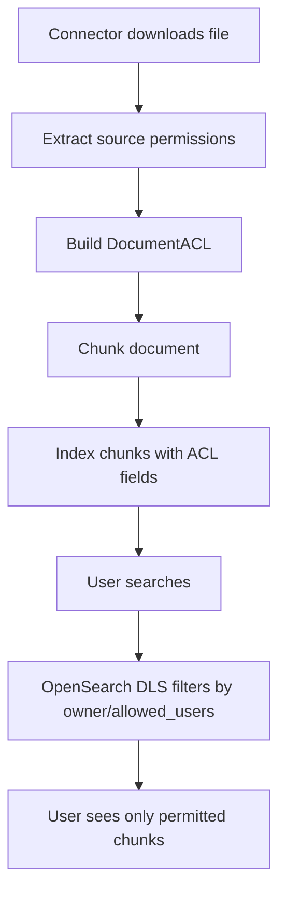

# ACL and Document-Level Security (DLS) in OpenRAG

## Important Notes

> **Onboarding / Org Admin**: The first user onboarded gets `all_access` role in OpenSearch, bypassing DLS - can see ALL chunks across all users. This is by design for organization administrator.

> **Tested Connectors**: ACL ingestion and DLS behavior have been validated for **SharePoint** and **Google Drive** only.

> **AWS S3 and IBM COS**: Different ownership model - the **ingesting user** becomes document owner in OpenRAG (not cloud ACL-based sharing like Drive/SharePoint).

---

## What the Functionality Is

OpenRAG stores "who may see this document" on every indexed chunk (`owner`, `allowed_users`, `allowed_groups`).

Connectors fill that from the source system when a file is ingested, so search respects the same idea as "shared with" in Drive or SharePoint. By default the user who ingests the document is considered as owner for the document.

OpenSearch applies Document-Level Security (DLS) so each logged-in user only gets chunks they are allowed to see (when security mode and user identities are set up correctly).

---

## How It Works

1. Connector downloads file metadata + permissions
2. Builds a `DocumentACL`
3. Document is chunked and indexed with those fields on each chunk
4. When someone searches, OpenSearch filters results using the current user's identity against `owner` and `allowed_users`

---

## Example (For SharePoint and Google Drive)

- File in Drive/SharePoint is owned by `alice@company.com` and shared read-only with `bob@company.com`
- After sync, chunks are indexed with `owner` and `allowed_users` reflecting those identities (Drive uses emails / SharePoint uses email when present)
- Alice and Bob can see the chunks in search if their OpenRAG/OpenSearch user id matches those strings (same as `${user.name}` in DLS)
- Someone else should not see those chunks unless they appear in `owner` / `allowed_users` or your deployment uses a special case (e.g. no-auth mode or documents without owner)

---

## Connector Testing Status

| Connector | ACL Tested | DLS Tested | Owner | Identity Type | Notes |
|-----------|------------|------------|-------|---------------|-------|
| **Google Drive** | Yes | Yes | Source file owner + ingesting user | Email addresses | Inherits file permissions (owner, readers, groups) |
| **SharePoint** | Yes | Yes | Source file owner + ingesting user | Email / Display name | Inherits file permissions via MS Graph API |
| **AWS S3** | No | No | **Ingesting user** | OpenRAG user ID | Ingesting user becomes owner; S3 ACL grants -> allowed_users |
| **IBM COS** | No | No | **Ingesting user** | OpenRAG user ID | Ingesting user becomes owner; fallback to service instance ID |
| **OneDrive** | No | No | Source file owner + ingesting user | Email / Display name | Similar to SharePoint (Graph API) |
| **Local Upload** | N/A | Yes | **Uploading user** | OpenRAG user ID | Uploading user is owner; no allow-lists |

---

## Technical Details

### Definitions

- **ACL** — Access Control List: `owner`, `allowed_users`, and `allowed_groups` stored on each indexed chunk (`DocumentACL` in `src/connectors/base.py`).
- **DLS** — Document-Level Security: OpenSearch Security filters reads using the `openrag_user_role` query on `owner` / `allowed_users` (see `securityconfig/roles.yml`). Users with `all_access` are not restricted by that filter.

### DocumentACL Fields

From `src/connectors/base.py`:

- `owner`: Single user ID (email or identifier)
- `allowed_users`: List of user IDs who can read
- `allowed_groups`: List of group IDs who can read

### Flow Diagram



### DLS Query Logic

From `securityconfig/roles.yml` - `openrag_user_role`:

```json
{
  "bool": {
    "should": [
      {"term": {"owner": "${user.name}"}},
      {"term": {"allowed_users": "${user.name}"}},
      {"bool": {"must_not": {"exists": {"field": "owner"}}}}
    ],
    "minimum_should_match": 1
  }
}
```

A user can see a chunk if:
1. They are the `owner`, OR
2. They are in `allowed_users`, OR
3. The chunk has no `owner` field (legacy/unowned)

---

## Connector-Specific Behavior

### Google Drive

- **API**: `permissions().list` on Drive API
- **Owner**: Email from permission with `role == "owner"` or file `owners[0]`
- **allowed_users**: Emails where `type == "user"`
- **allowed_groups**: Emails where `type == "group"`

### SharePoint

- **API**: MS Graph `/drive/items/{id}/permissions`
- **Owner**: User with `"owner"` in `roles`
- **allowed_users**: `grantedTo.user.email` or `displayName`
- **allowed_groups**: `grantedToIdentities.group.displayName` or `id`

### AWS S3

- **API**: `get_object_acl`
- **Owner**: Set to **ingesting OpenRAG user** (via Langflow path) or S3 ACL owner (traditional path)
- **allowed_users**: S3 grantees with `FULL_CONTROL` or `READ`
- **allowed_groups**: Always empty (S3 object ACLs don't map to app groups)

### IBM COS

- Same as S3, with fallback to `service_instance_id` when owner unavailable

### Local Uploads

- **Owner**: Authenticated OpenRAG user who uploads
- **allowed_users**: Empty
- **allowed_groups**: Empty

---

## Special Cases and Caveats

- **No-auth mode**: `owner` is `None` - documents may be visible to all (depends on DLS clause for missing owner)
- **ACL fetch failure**: Connectors degrade gracefully - Drive returns owner-only ACL, SharePoint returns empty ACL, S3/COS use fallback owner
- **`all_access` users**: Not filtered by DLS - see everything in the instance

---

## Key Files Reference

| File | Purpose |
|------|---------|
| `src/connectors/base.py` | `DocumentACL` dataclass definition |
| `src/connectors/google_drive/connector.py` | `_extract_google_drive_acl()` |
| `src/connectors/sharepoint/connector.py` | `_extract_sharepoint_acl()` |
| `src/connectors/aws_s3/connector.py` | `_extract_acl()` |
| `src/connectors/ibm_cos/connector.py` | `_extract_acl()` |
| `src/utils/acl_utils.py` | ACL change detection and bulk updates |
| `securityconfig/roles.yml` | DLS query for `openrag_user_role` |
