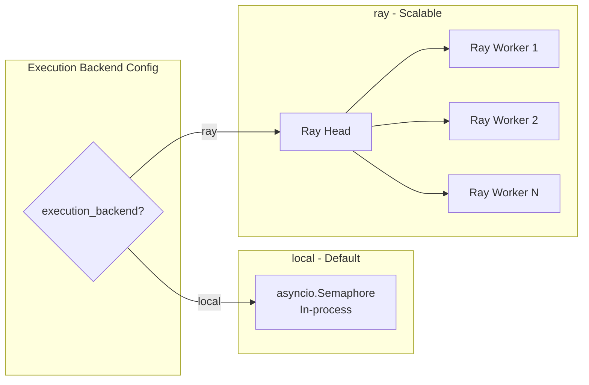
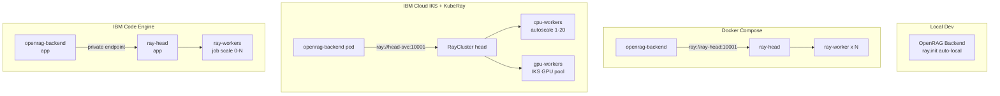

# Composable Ingestion Pipeline -- Complete Architecture

## 1. Execution Backend: Why Ray (and not Redis or Kafka)

### Comparison

- **Redis Streams**: Lightweight but requires a separate Redis server even for local dev. No built-in support for GPU scheduling, object passing between stages, or compute-aware placement. You end up building a task framework on top of a data structure.
- **Kafka**: Designed for event streaming between microservices, not compute orchestration. Extremely heavy for local dev (JVM, Zookeeper/KRaft). Overkill for "run this pipeline on a file". Good for log/event pipelines, wrong tool for document processing.
- **Celery + Redis/RabbitMQ**: Battle-tested but has well-known issues with asyncio, complex configuration, and poor support for ML/GPU workloads. Two moving parts (Celery + broker).
- **Ray**: Python-native distributed computing. `ray.init()` starts a local cluster with zero infrastructure -- just a pip install. Scales from laptop to 1000-node GPU cluster with the same code. Built-in fault tolerance, retries, object store for intermediate data, and a monitoring dashboard.

### Why Ray wins for OpenRAG

| Concern              | Ray                                                    |
| -------------------- | ------------------------------------------------------ |
| Local dev (no infra) | `ray.init()` -- zero external services needed          |
| Cloud / K8s          | KubeRay on IBM IKS, IBM Code Engine, or any K8s        |
| GPU-aware scheduling | Native -- place embedding tasks on GPU nodes           |
| Async compatible     | `ray.remote(async)` works with asyncio                 |
| Fault tolerance      | Built-in task retry, lineage reconstruction            |
| Intermediate data    | Ray Object Store -- no serialization to Redis          |
| Monitoring           | Ray Dashboard (bundled)                                |
| OSS                  | Apache 2.0 licensed                                    |
| Dependency           | `pip install ray[default]` (~50MB, not 300MB for full) |

### Abstracted Backend Interface

We define a thin `ExecutionBackend` protocol so the pipeline is not hard-coupled to Ray. This enables a fallback to plain asyncio for zero-dep local dev:

```python
class ExecutionBackend(Protocol):
    async def submit(self, pipeline: IngestionPipeline, tasks: list[FileTask]) -> BatchResult: ...
    async def get_progress(self, batch_id: str) -> BatchProgress: ...
    async def cancel(self, batch_id: str) -> None: ...
```

Two implementations ship out of the box:

- **`local`** (default): Runs pipelines in-process with `asyncio.Semaphore` -- current behavior, no extra deps. Good for small deployments and dev.
- **`ray`**: Distributes pipeline runs across a Ray cluster. Each file becomes a Ray task. Each stage within a pipeline can be a nested Ray task for stage-level parallelism (e.g., embed 500 chunks across 4 GPUs).



A third backend (Redis Streams, Celery, etc.) can be added later by implementing the protocol -- but Ray + local covers 99% of use cases from laptop to cloud.

---

## 2. LangChain: Use for Chunkers Only

LangChain is **not** a Python dependency of the OpenRAG backend today (not in `pyproject.toml`). It only runs inside the Langflow container. For the composable pipeline, use LangChain selectively:

### Chunkers -- YES, use `langchain-text-splitters`

This is a **lightweight standalone package** (~2MB, no full langchain dependency). It provides battle-tested implementations that are the de facto standard for RAG text splitting:

- `RecursiveCharacterTextSplitter` -- the most widely used chunker
- `CharacterTextSplitter` -- matches what the Langflow ingest flow uses today
- `SemanticChunker` -- embedding-similarity-based splitting (requires an embedder)
- `HTMLHeaderTextSplitter`, `MarkdownHeaderTextSplitter` -- structure-aware

Each composable chunker wraps the LangChain splitter inside our `Chunker` protocol:

```python
from langchain_text_splitters import RecursiveCharacterTextSplitter

class RecursiveChunker:
    def __init__(self, chunk_size: int = 1000, chunk_overlap: int = 200, separators: list[str] | None = None):
        self._splitter = RecursiveCharacterTextSplitter(
            chunk_size=chunk_size,
            chunk_overlap=chunk_overlap,
            separators=separators or ["\n\n", "\n", " ", ""],
        )

    async def chunk(self, doc: ParsedDocument) -> list[Chunk]:
        texts = self._splitter.split_text(doc.content)
        return [Chunk(text=t, index=i, source=doc.filename) for i, t in enumerate(texts)]
```

### Parsers -- NO LangChain

- **Docling**: Use **docling-serve** via HTTP (wraps existing [src/utils/docling_client.py](../src/utils/docling_client.py))
- **MarkItDown**: Use the `markitdown` package directly
- **Plain text**: Use existing logic from [src/utils/document_processing.py](../src/utils/document_processing.py)

LangChain document loaders add no value over these direct integrations.

### Embedders -- NO LangChain

The project already uses the **OpenAI SDK** (`openai` package) which provides a clean, async-native API. Each provider gets its own `Embedder` protocol implementation using native SDKs:

- **OpenAI** -- `openai.AsyncOpenAI` directly (already in deps)
- **Ollama** -- `openai.AsyncOpenAI` with `base_url` override (Ollama exposes an OpenAI-compatible `/v1/embeddings` endpoint)
- **WatsonX** -- `ibm-watsonx-ai` SDK directly, calling the WatsonX embeddings API natively. No LiteLLM.
- **HuggingFace** -- `sentence-transformers` directly for local embedding models

Each embedder wraps its native SDK in the `Embedder` protocol.

### Indexers -- NO LangChain

LangChain's `OpenSearchVectorStore` is more opinionated and less efficient than direct `opensearch-py` `_bulk` API calls. Keep direct control over bulk batching, retry, and ACL fields.

### Summary

| Component      | LangChain? | Package                           | Reason                                         |
| -------------- | ---------- | --------------------------------- | ---------------------------------------------- |
| Chunkers       | YES        | `langchain-text-splitters`        | Lightweight, battle-tested, de facto standard   |
| Semantic chunk  | YES        | `langchain-text-splitters`        | Needs embedder for similarity; LC handles this  |
| Parsers        | NO         | docling-serve, markitdown         | Direct HTTP/package is simpler                  |
| Embedders      | NO         | `openai`, `sentence-transformers` | Existing SDK pattern works for all providers    |
| Indexers       | NO         | `opensearch-py`                   | Direct bulk API gives full control              |

---

## 3. Design: Protocol-Based Stages

Each stage is a Python `Protocol` with a single async method. Implementations are registered in a component registry and selected by name from config.

```python
class DocumentParser(Protocol):
    async def parse(self, file_path: str, metadata: FileMetadata) -> ParsedDocument: ...

class Preprocessor(Protocol):
    async def process(self, doc: ParsedDocument) -> ParsedDocument: ...

class Chunker(Protocol):
    async def chunk(self, doc: ParsedDocument) -> list[Chunk]: ...

class Embedder(Protocol):
    async def embed(self, chunks: list[Chunk]) -> list[EmbeddedChunk]: ...

class Indexer(Protocol):
    async def index(self, chunks: list[EmbeddedChunk], metadata: FileMetadata) -> IndexResult: ...
```

The `IngestionPipeline` composes them:

```python
class IngestionPipeline:
    def __init__(self, parser, preprocessors, chunker, embedder, indexer): ...
    
    async def run(self, file_path: str, metadata: FileMetadata) -> PipelineResult:
        doc = await self.parser.parse(file_path, metadata)
        for pp in self.preprocessors:
            doc = await pp.process(doc)
        chunks = await self.chunker.chunk(doc)
        embedded = await self.embedder.embed(chunks)
        result = await self.indexer.index(embedded, metadata)
        return result
```

---

## 4. Pipeline Configuration File

### Location and Format

The project already loads YAML config from `config/config.yaml` via `ConfigManager` ([src/config/config_manager.py](../src/config/config_manager.py)). The pipeline config will be a **separate file** at:

```
config/pipeline.yaml
```

Separate file because:

- Pipeline config is complex and domain-specific (stages, per-stage options)
- Easier to swap/version pipeline configs independently
- Teams can iterate on pipeline config without touching app config
- Can ship multiple preset files in `config/presets/`

### Boot-Time Loading

`PipelineConfigManager` is called at startup from [src/main.py](../src/main.py) `initialize_services()`. Priority order (same pattern as existing config):

1. **Environment variables** (highest -- e.g., `PIPELINE_CHUNKER=semantic`)
2. **`config/pipeline.yaml`** file (or `PIPELINE_CONFIG_FILE` env var for alternate path)
3. **Defaults** (lowest -- sensible out-of-the-box config)

### Example `config/pipeline.yaml`

```yaml
# yaml-language-server: $schema=./pipeline.schema.json

version: "1"

ingestion_mode: composable  # langflow | traditional | composable

parser:
  type: auto            # auto | docling | markitdown | text
  docling:
    ocr: false
    ocr_engine: easyocr  # easyocr | tesseract
    picture_descriptions: false
    table_structure: true
  markitdown: {}

preprocessors:
  - type: cleaning
    strip_control_chars: true
    normalize_whitespace: true
  # - type: dedup
  #   strategy: content_hash   # content_hash | simhash
  # - type: metadata_enrichment
  #   extract_language: true

chunker:
  type: recursive       # recursive | character | semantic | page_table | docling_hybrid
  chunk_size: 1000
  chunk_overlap: 200
  separators:           # only for recursive/character
    - "\n\n"
    - "\n"
    - " "

embedder:
  provider: openai      # openai | watsonx | ollama | huggingface
  model: text-embedding-3-small
  batch_size: 100       # texts per API call
  max_tokens: 8000      # token limit per batch

indexer:
  type: opensearch_bulk
  bulk_batch_size: 500  # chunks per _bulk call
  retry_attempts: 3
  retry_backoff: 2.0

execution:
  backend: local        # local | ray
  concurrency: 4        # parallel files (local) or Ray parallelism
  timeout: 3600         # per-file timeout in seconds
  ray:                  # only used when backend=ray
    address: auto       # auto (local) | ray://<head>:10001 | env:RAY_ADDRESS
    num_cpus_per_task: 1
    num_gpus_per_task: 0  # set >0 for local embedding models
    max_retries: 3
```

---

## 5. Configuration Validation with Pydantic + JSON Schema

### Pydantic v2 Models

The project currently uses plain `dataclasses`. Pipeline config uses **Pydantic v2** `BaseModel` for:

- **Type validation** with clear error messages on load
- **JSON Schema generation** (`model_json_schema()`) for editor autocomplete
- **Default values** with `Field()`
- **Discriminated unions** for stage-specific options (e.g., chunker type determines which sub-fields are valid)
- **Environment variable overrides** via Pydantic Settings

```python
from pydantic import BaseModel, Field
from typing import Literal
from enum import Enum

class ParserType(str, Enum):
    auto = "auto"
    docling = "docling"
    markitdown = "markitdown"
    text = "text"

class ChunkerType(str, Enum):
    recursive = "recursive"
    character = "character"
    semantic = "semantic"
    page_table = "page_table"
    docling_hybrid = "docling_hybrid"

class DoclingOptions(BaseModel):
    ocr: bool = False
    ocr_engine: Literal["easyocr", "tesseract"] = "easyocr"
    table_structure: bool = True
    picture_descriptions: bool = False

class ParserConfig(BaseModel):
    type: ParserType = ParserType.auto
    docling: DoclingOptions = Field(default_factory=DoclingOptions)

class ChunkerConfig(BaseModel):
    type: ChunkerType = ChunkerType.recursive
    chunk_size: int = Field(default=1000, ge=100, le=10000)
    chunk_overlap: int = Field(default=200, ge=0, le=5000)
    separators: list[str] = Field(default_factory=lambda: ["\n\n", "\n", " "])

class EmbedderConfig(BaseModel):
    provider: Literal["openai", "watsonx", "ollama", "huggingface"] = "openai"
    model: str = "text-embedding-3-small"
    batch_size: int = Field(default=100, ge=1, le=2000)
    max_tokens: int = Field(default=8000, ge=100)

class ExecutionConfig(BaseModel):
    backend: Literal["local", "ray"] = "local"
    concurrency: int = Field(default=4, ge=1, le=64)
    timeout: int = Field(default=3600, ge=60)

class PipelineConfig(BaseModel):
    version: str = "1"
    ingestion_mode: Literal["langflow", "traditional", "composable"] = "langflow"
    parser: ParserConfig = Field(default_factory=ParserConfig)
    preprocessors: list[dict] = Field(default_factory=list)
    chunker: ChunkerConfig = Field(default_factory=ChunkerConfig)
    embedder: EmbedderConfig = Field(default_factory=EmbedderConfig)
    indexer: dict = Field(default_factory=lambda: {"type": "opensearch_bulk", "bulk_batch_size": 500})
    execution: ExecutionConfig = Field(default_factory=ExecutionConfig)
```

### JSON Schema Generation

At build time (or via a CLI command), auto-generate a JSON Schema file from the Pydantic model:

```
config/pipeline.schema.json
```

This gives YAML editors (VS Code with YAML extension) **autocomplete, hover docs, and inline validation** when the `# yaml-language-server: $schema=` directive is at the top of the file.

### Validation on Load

```python
class PipelineConfigManager:
    def load(self, path: Path = Path("config/pipeline.yaml")) -> PipelineConfig:
        if not path.exists():
            return PipelineConfig()  # all defaults
        
        raw = yaml.safe_load(path.read_text())
        config = PipelineConfig.model_validate(raw)  # raises ValidationError with clear messages
        self._apply_env_overrides(config)
        return config
```

Validation errors look like:

```
ValidationError: 1 validation error for PipelineConfig
chunker -> chunk_size
  Input should be greater than or equal to 100 [input_value=50]
```

---

## 6. Preset Pipeline Configurations

### Location

```
config/presets/
    default.yaml              # Current behavior (langflow mode)
    composable-basic.yaml     # Simple composable: auto parser, recursive chunker, OpenAI
    composable-docling.yaml   # Docling-optimized: docling parser, docling_hybrid chunker
    high-throughput.yaml      # 1M docs: Ray backend, large batches, high concurrency
    local-ollama.yaml         # Fully local: Ollama embeddings, no external APIs
    watsonx.yaml              # IBM stack: WatsonX embeddings, docling parser
```

### Preset Contents

**`default.yaml`** -- Maps to current Langflow behavior (for backward compat):

```yaml
# yaml-language-server: $schema=../pipeline.schema.json
version: "1"
ingestion_mode: langflow
```

**`composable-basic.yaml`** -- Simplest composable pipeline:

```yaml
version: "1"
ingestion_mode: composable
parser:
  type: auto
preprocessors:
  - type: cleaning
chunker:
  type: recursive
  chunk_size: 1000
  chunk_overlap: 200
embedder:
  provider: openai
  model: text-embedding-3-small
indexer:
  type: opensearch_bulk
  bulk_batch_size: 500
execution:
  backend: local
  concurrency: 4
```

**`composable-docling.yaml`** -- Docling-serve with structure-aware chunking:

```yaml
version: "1"
ingestion_mode: composable
parser:
  type: docling
  docling:
    ocr: false
    table_structure: true
preprocessors:
  - type: cleaning
chunker:
  type: docling_hybrid
  chunk_size: 1000
  chunk_overlap: 200
embedder:
  provider: openai
  model: text-embedding-3-small
indexer:
  type: opensearch_bulk
  bulk_batch_size: 500
execution:
  backend: local
  concurrency: 4
```

**`high-throughput.yaml`** -- Ray backend for 1M+ docs:

```yaml
version: "1"
ingestion_mode: composable
parser:
  type: auto
preprocessors:
  - type: cleaning
  - type: dedup
    strategy: content_hash
chunker:
  type: recursive
  chunk_size: 1000
  chunk_overlap: 200
embedder:
  provider: openai
  model: text-embedding-3-small
  batch_size: 200
  max_tokens: 8000
indexer:
  type: opensearch_bulk
  bulk_batch_size: 1000
  retry_attempts: 5
execution:
  backend: ray
  concurrency: 16
  timeout: 7200
  ray:
    address: auto
    num_cpus_per_task: 1
    max_retries: 3
```

**`local-ollama.yaml`** -- Fully local, no external API calls:

```yaml
version: "1"
ingestion_mode: composable
parser:
  type: auto
preprocessors:
  - type: cleaning
chunker:
  type: recursive
  chunk_size: 500
  chunk_overlap: 100
embedder:
  provider: ollama
  model: nomic-embed-text
  batch_size: 50
indexer:
  type: opensearch_bulk
  bulk_batch_size: 200
execution:
  backend: local
  concurrency: 2
```

**`watsonx.yaml`** -- IBM WatsonX stack:

```yaml
version: "1"
ingestion_mode: composable
parser:
  type: docling
  docling:
    ocr: true
    ocr_engine: easyocr
    table_structure: true
preprocessors:
  - type: cleaning
  - type: dedup
    strategy: content_hash
chunker:
  type: recursive
  chunk_size: 1000
  chunk_overlap: 200
embedder:
  provider: watsonx
  model: ibm/slate-125m-english-rtrvr-v2
  batch_size: 100
indexer:
  type: opensearch_bulk
  bulk_batch_size: 500
execution:
  backend: local
  concurrency: 4
```

### Using a Preset

Copy a preset to the active config location:

```bash
cp config/presets/composable-basic.yaml config/pipeline.yaml
```

Or reference via env var (the `PipelineConfigManager` supports this):

```bash
PIPELINE_CONFIG_FILE=config/presets/high-throughput.yaml
```

---

## 7. File Structure

```
src/pipeline/
    __init__.py
    types.py                # ParsedDocument, Chunk, EmbeddedChunk, FileMetadata, PipelineResult
    registry.py             # Component registry (register/get by name)
    pipeline.py             # IngestionPipeline orchestrator + PipelineBuilder
    config.py               # PipelineConfig Pydantic models + PipelineConfigManager
    schema_gen.py           # CLI: python -m pipeline.schema_gen -> writes pipeline.schema.json
    cli.py                  # CLI entry point: python -m pipeline.cli

    parsers/
        __init__.py         # Re-exports + auto-register
        base.py             # DocumentParser protocol
        docling.py          # Wraps docling-serve via HTTP (docling_client.py)
        markitdown.py       # MarkItDown package integration
        text.py             # Wraps existing process_text_file logic
        auto.py             # Auto-detect parser by file extension

    preprocessors/
        __init__.py
        base.py             # Preprocessor protocol
        cleaning.py         # Strip control chars, normalize whitespace
        dedup.py            # Content-hash dedup check against OpenSearch
        metadata.py         # Extract/enrich metadata (language, dates, etc.)

    chunkers/
        __init__.py
        base.py             # Chunker protocol
        recursive.py        # Wraps langchain RecursiveCharacterTextSplitter
        character.py        # Wraps langchain CharacterTextSplitter
        semantic.py         # Wraps langchain SemanticChunker
        page_table.py       # Current extract_relevant logic (page + table chunks)
        docling_hybrid.py   # Docling structure-aware + recursive fallback

    embedders/
        __init__.py
        base.py             # Embedder protocol
        openai_embedder.py  # openai.AsyncOpenAI SDK
        watsonx_embedder.py # ibm-watsonx-ai SDK (native, no LiteLLM)
        ollama_embedder.py  # openai.AsyncOpenAI with base_url override
        huggingface_embedder.py  # sentence-transformers local

    indexers/
        __init__.py
        base.py             # Indexer protocol
        opensearch_bulk.py  # Bulk indexing with opensearch-py _bulk API

    execution/
        __init__.py
        base.py             # ExecutionBackend protocol
        local_backend.py    # asyncio.Semaphore, in-process (default, zero deps)
        ray_backend.py      # Ray-based distributed execution

config/
    pipeline.yaml           # Active pipeline configuration (loaded at boot)
    pipeline.schema.json    # Auto-generated JSON Schema for editor support
    presets/
        default.yaml
        composable-basic.yaml
        composable-docling.yaml
        high-throughput.yaml
        local-ollama.yaml
        watsonx.yaml

scripts/
    start-ray.sh            # Local Ray dev script

kubernetes/ray/
    ray-cluster.yaml        # KubeRay RayCluster custom resource
    kustomization.yaml      # Kustomize overlay
    values-ray.yaml         # Helm values override

tests/pipeline/
    __init__.py
    conftest.py             # Shared fixtures
    test_config.py
    test_config_validation.py
    test_registry.py
    test_parsers.py
    test_chunkers.py
    test_embedders.py
    test_indexer.py
    test_pipeline.py
    test_integration.py
    test_e2e.py

test-docs/
    sample.pdf
    sample.txt
    sample.md
    sample.docx
    sample.html
```

---

## 8. Integration with Existing Config System

The existing `ConfigManager` in [src/config/config_manager.py](../src/config/config_manager.py) already:

- Loads YAML from `config/config.yaml`
- Supports env overrides
- Has `load_config()` called at startup

We add `PipelineConfigManager` as a parallel manager (not nested inside `ConfigManager`) to keep concerns separate. It is initialized in [src/main.py](../src/main.py) `initialize_services()` and stored in `app.state.services["pipeline_config"]`.

The `ingestion_mode` field in `pipeline.yaml` replaces the boolean `DISABLE_INGEST_WITH_LANGFLOW` env var with a three-way switch, while remaining backward compatible (the env var still works and maps to `traditional` mode when set to `true`).

---

## 9. Docker Compose Changes

For the `ray` backend, add an optional Ray head service:

```yaml
# Optional: only needed when execution.backend=ray
ray-head:
  image: rayproject/ray:2.44.1-py313
  container_name: ray-head
  ports:
    - "6379:6379"    # Ray client port
    - "8265:8265"    # Ray Dashboard
  command: ray start --head --port=6379 --dashboard-host=0.0.0.0 --block
  profiles: ["ray"]  # only starts with: docker compose --profile ray up

ray-worker:
  image: rayproject/ray:2.44.1-py313
  container_name: ray-worker
  command: ray start --address=ray-head:6379 --block
  depends_on: [ray-head]
  deploy:
    replicas: 2
  profiles: ["ray"]
```

Using Docker Compose **profiles**, Ray services only start when explicitly requested (`docker compose --profile ray up`). The `local` backend needs nothing extra.

---

## 10. Dependency Changes in [pyproject.toml](../pyproject.toml)

```toml
dependencies = [
    # ... existing ...
    "pydantic>=2.0",                   # pipeline config validation
    "langchain-text-splitters>=0.3",   # core chunkers (lightweight, no full langchain)
]

[project.optional-dependencies]
ray = ["ray[default]>=2.44"]
markitdown = ["markitdown>=0.1"]
huggingface = ["sentence-transformers>=3.0"]  # local embeddings
```

Ray, MarkItDown, and HuggingFace are **optional extras** -- not required for the default `local` + `docling` + `openai` path. This keeps the base install lightweight.

---

## 11. Deployment Scripts and Configurations

### 11a. Local Dev Script -- `scripts/start-ray.sh`

A convenience script for developers who want to test the Ray backend locally without Docker:

```bash
#!/usr/bin/env bash
set -euo pipefail

NUM_WORKERS=${1:-2}

echo "Starting Ray head node..."
ray start --head --port=6379 --dashboard-host=0.0.0.0

echo "Ray Dashboard: http://localhost:8265"
echo "Ray Address:   ray://localhost:10001"
echo ""
echo "Set in config/pipeline.yaml:"
echo "  execution:"
echo "    backend: ray"
echo "    ray:"
echo "      address: auto"

# Optionally start local workers (for multi-process testing)
if [ "$NUM_WORKERS" -gt 0 ]; then
  echo "Starting $NUM_WORKERS local workers..."
  for i in $(seq 1 "$NUM_WORKERS"); do
    ray start --address=localhost:6379 --num-cpus=2
  done
fi

echo "Ray cluster ready. Stop with: ray stop"
```

Usage: `./scripts/start-ray.sh` (starts head + 2 workers) or `./scripts/start-ray.sh 0` (head only, Ray auto-uses local CPUs).

### 11b. Docker Compose -- `docker-compose.yml` Ray Profile

Uses Docker Compose profiles so Ray services are opt-in:

```bash
# Without Ray (default -- uses local asyncio backend):
docker compose up

# With Ray:
docker compose --profile ray up

# Scale Ray workers:
docker compose --profile ray up --scale ray-worker=8
```

The `openrag-backend` container connects to Ray via `ray://ray-head:10001` (configured in `pipeline.yaml` or `RAY_ADDRESS` env var).

### 11c. Kubernetes -- KubeRay Deployment

New directory: `kubernetes/ray/`

**`ray-cluster.yaml`** -- KubeRay RayCluster CR:

```yaml
apiVersion: ray.io/v1
kind: RayCluster
metadata:
  name: openrag-ray
spec:
  rayVersion: "2.44.1"
  headGroupSpec:
    rayStartParams:
      dashboard-host: "0.0.0.0"
    template:
      spec:
        containers:
          - name: ray-head
            image: rayproject/ray:2.44.1-py313
            ports:
              - containerPort: 6379   # GCS
              - containerPort: 8265   # Dashboard
              - containerPort: 10001  # Client
            resources:
              requests: { cpu: "2", memory: "4Gi" }
              limits: { cpu: "4", memory: "8Gi" }
  workerGroupSpecs:
    - groupName: cpu-workers
      replicas: 2
      minReplicas: 1
      maxReplicas: 20
      rayStartParams: {}
      template:
        spec:
          containers:
            - name: ray-worker
              image: rayproject/ray:2.44.1-py313
              resources:
                requests: { cpu: "2", memory: "4Gi" }
                limits: { cpu: "4", memory: "8Gi" }
    - groupName: gpu-workers
      replicas: 0
      minReplicas: 0
      maxReplicas: 4
      rayStartParams:
        num-gpus: "1"
      template:
        spec:
          containers:
            - name: ray-worker-gpu
              image: rayproject/ray:2.44.1-py313-gpu
              resources:
                requests: { nvidia.com/gpu: "1" }
                limits: { nvidia.com/gpu: "1" }
```

**`values-ray.yaml`** -- Helm values override:

```yaml
backend:
  env:
    PIPELINE_EXECUTION_BACKEND: ray
    RAY_ADDRESS: "ray://openrag-ray-head-svc:10001"
ray:
  enabled: true
  clusterName: openrag-ray
  head:
    resources:
      requests: { cpu: "2", memory: "4Gi" }
  workers:
    cpu:
      replicas: 2
      minReplicas: 1
      maxReplicas: 20
      resources:
        requests: { cpu: "2", memory: "4Gi" }
    gpu:
      replicas: 0
      maxReplicas: 4
```

### 11d. Cloud Deployment Guide -- `docs/deployment/ray-deployment.md`

**Path 1: Docker Compose (single server / VM)**

- For small-medium deployments (up to ~100K documents)
- Works on any VM: IBM Cloud Virtual Server, bare metal, or local machine
- `docker compose --profile ray up --scale ray-worker=4`
- Monitor via Ray Dashboard at `:8265`

**Path 2: IBM Cloud Kubernetes Service (IKS) + KubeRay**

- For large deployments (1M+ documents)
- IBM Cloud IKS provides managed Kubernetes with integrated IBM Cloud services
- KubeRay autoscaler scales workers 0->N based on pending Ray task queue depth
- GPU worker group available via IKS GPU-enabled worker pools (e.g., `gx3.16x80x1v100` profiles)
- Integrates with IBM Cloud Object Storage for document staging and IBM watsonx for embeddings

```bash
# Create IKS cluster with worker pool
ibmcloud ks cluster create vpc-gen2 \
  --name openrag-cluster \
  --zone us-south-1 \
  --flavor bx2.8x32 \
  --workers 4

# Add GPU worker pool (optional, for local embedding models)
ibmcloud ks worker-pool create vpc-gen2 \
  --name gpu-pool \
  --cluster openrag-cluster \
  --flavor gx3.16x80x1v100 \
  --size-per-zone 2

# Install KubeRay operator
helm install kuberay-operator kuberay/kuberay-operator

# Deploy Ray cluster
kubectl apply -f kubernetes/ray/ray-cluster.yaml

# Deploy OpenRAG with Ray backend
helm install openrag ./kubernetes/helm/openrag \
  -f kubernetes/ray/values-ray.yaml
```

**Path 3: IBM Code Engine (serverless containers)**

- For teams that want managed compute without managing Kubernetes
- IBM Code Engine runs containerized workloads with auto-scaling (including scale-to-zero)
- Deploy `openrag-backend` as a Code Engine **application**, Ray head as a fixed **application**, Ray workers as Code Engine **jobs** that scale based on ingestion load
- Integrates natively with IBM Cloud Object Storage, watsonx.ai, and IBM Cloud Databases for OpenSearch

```bash
# Create Code Engine project
ibmcloud ce project create --name openrag

# Deploy Ray head
ibmcloud ce app create --name ray-head \
  --image rayproject/ray:2.44.1-py313 \
  --port 10001 \
  --min-scale 1 --max-scale 1 \
  --cpu 4 --memory 8G

# Deploy Ray workers as a job
ibmcloud ce job create --name ray-worker \
  --image rayproject/ray:2.44.1-py313 \
  --cpu 2 --memory 4G \
  --array-size 4
```

**Common operations** documented:

- Scaling workers up/down
- Monitoring via Ray Dashboard
- Draining workers gracefully
- Handling GPU vs CPU task placement
- IBM Cloud IAM integration for service-to-service auth
- Connecting to IBM Cloud OpenSearch (managed) and watsonx.ai embeddings
- Troubleshooting common issues

---

## 12. Deployment Architecture Diagram



---

## 13. Local Run and Test Plan

### Prerequisites

```bash
# 1. Install OpenRAG with pipeline extras
pip install -e ".[ray,markitdown,huggingface]"

# 2. Start OpenSearch (required for indexing)
docker compose up opensearch -d

# 3. Start docling-serve (required for non-text documents)
uvx docling-serve run --port 5001

# 4. Set up a preset config
cp config/presets/composable-basic.yaml config/pipeline.yaml

# 5. Set required env vars
export OPENAI_API_KEY=sk-...
export OPENSEARCH_PASSWORD=your-password
```

### Running the Composable Pipeline

**Option A: Via the API (full stack)**

```bash
# Start the backend with composable mode
python -m uvicorn main:app --host 0.0.0.0 --port 8080 --app-dir src

# Upload a document via API
curl -X POST http://localhost:8080/v1/documents/ingest \
  -H "Content-Type: multipart/form-data" \
  -F "files=@test-docs/sample.pdf"

# Check task status
curl http://localhost:8080/v1/tasks/{task_id}
```

**Option B: Via CLI (pipeline directly, no API server)**

A CLI entry point for testing pipelines without starting the full server:

```bash
# Run pipeline on a single file
python -m pipeline.cli run test-docs/sample.pdf

# Run pipeline on a directory
python -m pipeline.cli run test-docs/ --recursive

# Run with a specific preset
python -m pipeline.cli run test-docs/sample.pdf --config config/presets/local-ollama.yaml

# Dry run (parse + chunk, skip embed + index)
python -m pipeline.cli run test-docs/sample.pdf --dry-run

# Test individual stages
python -m pipeline.cli parse test-docs/sample.pdf          # Parser only
python -m pipeline.cli chunk test-docs/sample.txt           # Parse + chunk
python -m pipeline.cli embed test-docs/sample.txt           # Parse + chunk + embed
```

### Testing with Ray Backend

```bash
# Start Ray locally
./scripts/start-ray.sh 0   # head only, uses local CPUs

# Update config to use Ray
# In config/pipeline.yaml, set execution.backend: ray

# Run pipeline (uses Ray cluster)
python -m pipeline.cli run test-docs/ --recursive

# Monitor via Ray Dashboard
open http://localhost:8265
```

### Running Tests

```bash
# Unit tests for pipeline components (no external services needed)
pytest tests/pipeline/ -v

# Specific stage tests
pytest tests/pipeline/test_chunkers.py -v
pytest tests/pipeline/test_parsers.py -v
pytest tests/pipeline/test_config.py -v

# Integration tests (requires OpenSearch + docling-serve running)
pytest tests/pipeline/test_integration.py -v

# End-to-end: ingest a test doc and verify it appears in OpenSearch
pytest tests/pipeline/test_e2e.py -v

# Config validation tests
pytest tests/pipeline/test_config_validation.py -v
```

### Quick Smoke Test (one-liner)

```bash
# After setup, this verifies the full composable pipeline works end-to-end:
echo "Hello, OpenRAG composable pipeline test." > /tmp/test.txt && \
  python -m pipeline.cli run /tmp/test.txt && \
  echo "Pipeline smoke test passed"
```

---

## 14. What Stays the Same

- All existing Langflow ingestion code is untouched
- All existing traditional ingestion code is untouched
- `DISABLE_INGEST_WITH_LANGFLOW` continues to work as before
- Default `ingestion_mode` remains `"langflow"` -- zero breaking changes
- Existing `KnowledgeConfig` fields (`embedding_model`, `embedding_provider`, `chunk_size`, `chunk_overlap`) are reused by composable pipeline defaults

---

## 15. Implementation Order

Build bottom-up: config -> types -> protocols -> implementations -> pipeline -> CLI -> workers -> API integration -> deployment.

1. **Pydantic Config Models** -- `PipelineConfig`, `ParserConfig`, `ChunkerConfig`, `EmbedderConfig`, `ExecutionConfig` with `PipelineConfigManager` (YAML load + env overrides + validation)
2. **JSON Schema Generator** -- CLI to auto-generate `config/pipeline.schema.json` from the Pydantic model
3. **Default `config/pipeline.yaml`** and **preset configs** in `config/presets/`
4. **Types and Protocols** -- `ParsedDocument`, `Chunk`, `EmbeddedChunk`, `FileMetadata`, `PipelineResult`; `DocumentParser`, `Preprocessor`, `Chunker`, `Embedder`, `Indexer` protocols
5. **Component Registry** -- register/get by name, auto-discovery of implementations
6. **Parsers** -- DoclingParser (wraps docling-serve via HTTP), MarkItDownParser (markitdown package), PlainTextParser (wraps existing `process_text_file`), AutoParser (extension-based dispatch)
7. **Preprocessors** -- CleaningPreprocessor, DedupPreprocessor, MetadataPreprocessor
8. **Chunkers** -- RecursiveChunker, CharacterChunker, SemanticChunker (all wrapping `langchain-text-splitters`), PageTableChunker (wraps `extract_relevant`), DoclingHybridChunker
9. **Embedders** -- OpenAIEmbedder (`openai` SDK), WatsonXEmbedder (`ibm-watsonx-ai` SDK, no LiteLLM), OllamaEmbedder (`openai` SDK with `base_url`), HuggingFaceEmbedder (`sentence-transformers`) -- all with batching and token-limit awareness
10. **Bulk Indexer** -- OpenSearchBulkIndexer using `opensearch-py` `_bulk` API with configurable batch size, retry logic, and ACL support
11. **Execution Backends** -- `ExecutionBackend` protocol + `LocalBackend` (asyncio) + `RayBackend` (ray.remote tasks)
12. **Pipeline Orchestrator** -- `IngestionPipeline` + `PipelineBuilder` that assembles stages from `PipelineConfig` via the registry
13. **Pipeline CLI** -- `python -m pipeline.cli` with `run`, `parse`, `chunk`, `embed` subcommands and `--dry-run`, `--config`, `--recursive` flags
14. **API Integration** -- composable branch in `router.py`, `PipelineService`, registration in `main.py`/`dependencies.py`
15. **Dependencies** -- `pydantic` and `langchain-text-splitters` to core deps; `ray`, `markitdown`, `huggingface` as optional extras in `pyproject.toml`
16. **Docker Compose** -- Ray head and worker services under `profiles: [ray]`
17. **Local Dev Script** -- `scripts/start-ray.sh`
18. **Kubernetes Deployment** -- KubeRay `RayCluster` CR, Helm values override, Kustomize overlay
19. **Cloud Deployment Docs** -- `docs/deployment/ray-deployment.md` covering Docker Compose, IBM IKS + KubeRay, and IBM Code Engine
20. **Test Suite** -- Unit tests for all components, integration tests, e2e tests, sample test documents
