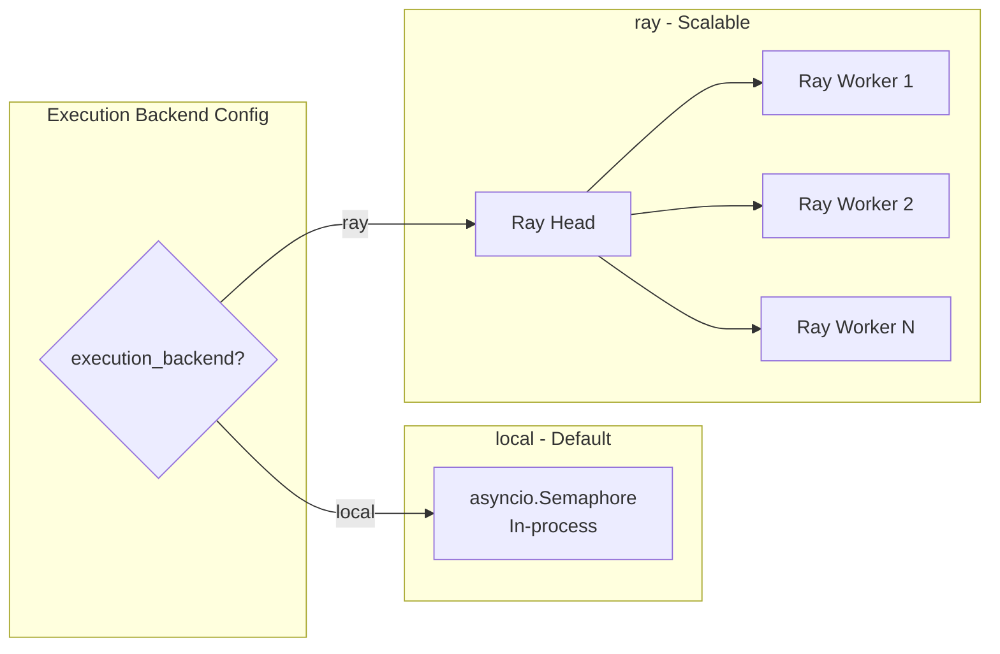
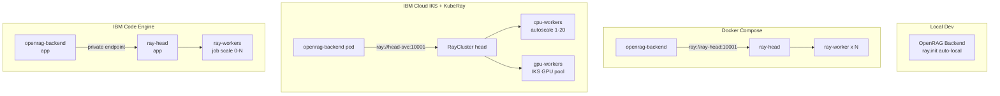

# Composable Ingestion Pipeline -- Refined Architecture

## 1. Execution Backend: Why Ray (and not Redis or Kafka)

### Comparison

- **Redis Streams**: Lightweight but requires a separate Redis server even for local dev. No built-in support for GPU scheduling, object passing between stages, or compute-aware placement. You end up building a task framework on top of a data structure.
- **Kafka**: Designed for event streaming between microservices, not compute orchestration. Extremely heavy for local dev (JVM, Zookeeper/KRaft). Overkill for "run this pipeline on a file". Good for log/event pipelines, wrong tool for document processing.
- **Celery + Redis/RabbitMQ**: Battle-tested but has well-known issues with asyncio, complex configuration, and poor support for ML/GPU workloads. Two moving parts (Celery + broker).
- **Ray**: Python-native distributed computing. `ray.init()` starts a local cluster with zero infrastructure -- just a pip install. Scales from laptop to 1000-node GPU cluster with the same code. Built-in fault tolerance, retries, object store for intermediate data, and a monitoring dashboard.

### Why Ray wins for OpenRAG

| Concern              | Ray                                                    |
| -------------------- | ------------------------------------------------------ |
| Local dev (no infra) | `ray.init()` -- zero external services needed          |
| Cloud / K8s          | KubeRay on IBM IKS, IBM Code Engine, or any K8s        |
| GPU-aware scheduling | Native -- place embedding tasks on GPU nodes           |
| Async compatible     | `ray.remote(async)` works with asyncio                 |
| Fault tolerance      | Built-in task retry, lineage reconstruction            |
| Intermediate data    | Ray Object Store -- no serialization to Redis          |
| Monitoring           | Ray Dashboard (bundled)                                |
| OSS                  | Apache 2.0 licensed                                    |
| Dependency           | `pip install ray[default]` (~50MB, not 300MB for full) |

### Abstracted Backend Interface

We still define a thin `ExecutionBackend` protocol so the pipeline is not hard-coupled to Ray. This enables a fallback to plain asyncio for zero-dep local dev:

```python
class ExecutionBackend(Protocol):
    async def submit(self, pipeline: IngestionPipeline, tasks: list[FileTask]) -> BatchResult: ...
    async def get_progress(self, batch_id: str) -> BatchProgress: ...
    async def cancel(self, batch_id: str) -> None: ...
```

Two implementations ship out of the box:

- **`local`** (default): Runs pipelines in-process with `asyncio.Semaphore` -- current behavior, no extra deps. Good for small deployments and dev.
- **`ray`**: Distributes pipeline runs across a Ray cluster. Each file becomes a Ray task. Each stage within a pipeline can be a nested Ray task for stage-level parallelism (e.g., embed 500 chunks across 4 GPUs).



A third backend (Redis Streams, Celery, etc.) can be added later by implementing the protocol -- but Ray + local covers 99% of use cases from laptop to cloud.

---

## 2. Pipeline Configuration File

### Location and Format

The project already loads YAML config from `config/config.yaml` via `ConfigManager` ([src/config/config_manager.py](../src/config/config_manager.py)). The pipeline config will be a **separate file** at:

```
config/pipeline.yaml
```

Separate file because:

- Pipeline config is complex and domain-specific (stages, per-stage options)
- Easier to swap/version pipeline configs independently
- Teams can iterate on pipeline config without touching app config
- Can ship multiple preset files (`pipeline.default.yaml`, `pipeline.high-throughput.yaml`)

### Boot-Time Loading

`ConfigManager` gains a `load_pipeline_config()` method called at startup from [src/main.py](../src/main.py) `initialize_services()`. Priority order (same pattern as existing config):

1. **Environment variables** (highest -- e.g., `PIPELINE_CHUNKER=semantic`)
2. **`config/pipeline.yaml`** file
3. **Defaults** (lowest -- sensible out-of-the-box config)

### Example `config/pipeline.yaml`

```yaml
# yaml-language-server: $schema=./pipeline.schema.json

version: "1"

ingestion_mode: composable  # langflow | traditional | composable

parser:
  type: auto            # auto | docling | markitdown | text
  docling:
    ocr: false
    ocr_engine: easyocr  # easyocr | tesseract
    picture_descriptions: false
    table_structure: true
  markitdown: {}

preprocessors:
  - type: cleaning
    strip_control_chars: true
    normalize_whitespace: true
  # - type: dedup
  #   strategy: content_hash   # content_hash | simhash
  # - type: metadata_enrichment
  #   extract_language: true

chunker:
  type: recursive       # recursive | character | semantic | page_table | docling_hybrid
  chunk_size: 1000
  chunk_overlap: 200
  separators:           # only for recursive/character
    - "\n\n"
    - "\n"
    - " "

embedder:
  provider: openai      # openai | watsonx | ollama | huggingface
  model: text-embedding-3-small
  batch_size: 100       # texts per API call
  max_tokens: 8000      # token limit per batch

indexer:
  type: opensearch_bulk
  bulk_batch_size: 500  # chunks per _bulk call
  retry_attempts: 3
  retry_backoff: 2.0

execution:
  backend: local        # local | ray
  concurrency: 4        # parallel files (local) or Ray parallelism
  timeout: 3600         # per-file timeout in seconds
  ray:                  # only used when backend=ray
    address: auto       # auto (local) | ray://<head>:10001 | env:RAY_ADDRESS
    num_cpus_per_task: 1
    num_gpus_per_task: 0  # set >0 for local embedding models
    max_retries: 3
```

---

## 3. Configuration Validation with Pydantic + JSON Schema

### Pydantic v2 Models

The project currently uses plain `dataclasses`. Pipeline config uses **Pydantic v2** `BaseModel` for:

- **Type validation** with clear error messages on load
- **JSON Schema generation** (`model_json_schema()`) for editor autocomplete
- **Default values** with `Field()`
- **Discriminated unions** for stage-specific options (e.g., chunker type determines which sub-fields are valid)
- **Environment variable overrides** via Pydantic Settings

```python
from pydantic import BaseModel, Field
from typing import Literal
from enum import Enum

class ParserType(str, Enum):
    auto = "auto"
    docling = "docling"
    markitdown = "markitdown"
    text = "text"

class ChunkerType(str, Enum):
    recursive = "recursive"
    character = "character"
    semantic = "semantic"
    page_table = "page_table"
    docling_hybrid = "docling_hybrid"

class DoclingOptions(BaseModel):
    ocr: bool = False
    ocr_engine: Literal["easyocr", "tesseract"] = "easyocr"
    table_structure: bool = True
    picture_descriptions: bool = False

class ParserConfig(BaseModel):
    type: ParserType = ParserType.auto
    docling: DoclingOptions = Field(default_factory=DoclingOptions)

class ChunkerConfig(BaseModel):
    type: ChunkerType = ChunkerType.recursive
    chunk_size: int = Field(default=1000, ge=100, le=10000)
    chunk_overlap: int = Field(default=200, ge=0, le=5000)
    separators: list[str] = Field(default_factory=lambda: ["\n\n", "\n", " "])

class EmbedderConfig(BaseModel):
    provider: Literal["openai", "watsonx", "ollama", "huggingface"] = "openai"
    model: str = "text-embedding-3-small"
    batch_size: int = Field(default=100, ge=1, le=2000)
    max_tokens: int = Field(default=8000, ge=100)

class ExecutionConfig(BaseModel):
    backend: Literal["local", "ray"] = "local"
    concurrency: int = Field(default=4, ge=1, le=64)
    timeout: int = Field(default=3600, ge=60)

class PipelineConfig(BaseModel):
    version: str = "1"
    ingestion_mode: Literal["langflow", "traditional", "composable"] = "langflow"
    parser: ParserConfig = Field(default_factory=ParserConfig)
    preprocessors: list[dict] = Field(default_factory=list)
    chunker: ChunkerConfig = Field(default_factory=ChunkerConfig)
    embedder: EmbedderConfig = Field(default_factory=EmbedderConfig)
    indexer: dict = Field(default_factory=lambda: {"type": "opensearch_bulk", "bulk_batch_size": 500})
    execution: ExecutionConfig = Field(default_factory=ExecutionConfig)
```

### JSON Schema Generation

At build time (or via a CLI command), auto-generate a JSON Schema file from the Pydantic model:

```
config/pipeline.schema.json
```

This gives YAML editors (VS Code with YAML extension) **autocomplete, hover docs, and inline validation** when the `# yaml-language-server: $schema=` directive is at the top of the file.

### Validation on Load

```python
class PipelineConfigManager:
    def load(self, path: Path = Path("config/pipeline.yaml")) -> PipelineConfig:
        if not path.exists():
            return PipelineConfig()  # all defaults
        
        raw = yaml.safe_load(path.read_text())
        config = PipelineConfig.model_validate(raw)  # raises ValidationError with clear messages
        self._apply_env_overrides(config)
        return config
```

Validation errors look like:

```
ValidationError: 1 validation error for PipelineConfig
chunker -> chunk_size
  Input should be greater than or equal to 100 [input_value=50]
```

---

## 4. Updated File Structure

```
src/pipeline/
    __init__.py
    types.py                # ParsedDocument, Chunk, EmbeddedChunk, FileMetadata, PipelineResult
    registry.py             # Component registry (register/get by name)
    pipeline.py             # IngestionPipeline orchestrator + PipelineBuilder
    config.py               # PipelineConfig Pydantic models (above) + PipelineConfigManager
    schema_gen.py           # CLI: python -m pipeline.schema_gen -> writes pipeline.schema.json

    parsers/                # DocumentParser protocol + implementations
    preprocessors/          # Preprocessor protocol + implementations
    chunkers/               # Chunker protocol + implementations
    embedders/              # Embedder protocol + implementations
    indexers/               # Indexer protocol + implementations (OpenSearch bulk)

    execution/
        __init__.py
        base.py             # ExecutionBackend protocol
        local_backend.py    # asyncio.Semaphore, in-process (default, zero deps)
        ray_backend.py      # Ray-based distributed execution

config/
    pipeline.yaml           # Pipeline configuration (loaded at boot)
    pipeline.schema.json    # Auto-generated JSON Schema for editor support
```

---

## 5. Integration with Existing Config System

The existing `ConfigManager` in [src/config/config_manager.py](../src/config/config_manager.py) already:

- Loads YAML from `config/config.yaml`
- Supports env overrides
- Has `load_config()` called at startup

We add `PipelineConfigManager` as a parallel manager (not nested inside `ConfigManager`) to keep concerns separate. It is initialized in [src/main.py](../src/main.py) `initialize_services()` and stored in `app.state.services["pipeline_config"]`.

The `ingestion_mode` field in `pipeline.yaml` replaces the boolean `DISABLE_INGEST_WITH_LANGFLOW` env var with a three-way switch, while remaining backward compatible (the env var still works and maps to `traditional` mode when set to `true`).

---

## 6. Docker Compose Changes

For the `ray` backend, add an optional Ray head service:

```yaml
# Optional: only needed when execution.backend=ray
ray-head:
  image: rayproject/ray:2.44.1-py313
  container_name: ray-head
  ports:
    - "6379:6379"    # Ray client port
    - "8265:8265"    # Ray Dashboard
  command: ray start --head --port=6379 --dashboard-host=0.0.0.0 --block
  profiles: ["ray"]  # only starts with: docker compose --profile ray up

ray-worker:
  image: rayproject/ray:2.44.1-py313
  container_name: ray-worker
  command: ray start --address=ray-head:6379 --block
  depends_on: [ray-head]
  deploy:
    replicas: 2
  profiles: ["ray"]
```

Using Docker Compose **profiles**, Ray services only start when explicitly requested (`docker compose --profile ray up`). The `local` backend needs nothing extra.

---

## 7. Dependency Changes in [pyproject.toml](../pyproject.toml)

```toml
dependencies = [
    # ... existing ...
    "pydantic>=2.0",          # pipeline config validation
]

[project.optional-dependencies]
ray = ["ray[default]>=2.44"]      # opt-in: pip install openrag[ray]
markitdown = ["markitdown>=0.1"]  # opt-in: pip install openrag[markitdown]
semantic-chunking = ["langchain-text-splitters>=0.2", "sentence-transformers>=3.0"]
```

Ray and MarkItDown are **optional extras** -- not required for the default `local` + `docling` path. This keeps the base install lightweight.

---

## 8. Deployment Scripts and Configurations

### 8a. Local Dev Script -- `scripts/start-ray.sh`

A convenience script for developers who want to test the Ray backend locally without Docker:

```bash
#!/usr/bin/env bash
set -euo pipefail

NUM_WORKERS=${1:-2}

echo "Starting Ray head node..."
ray start --head --port=6379 --dashboard-host=0.0.0.0

echo "Ray Dashboard: http://localhost:8265"
echo "Ray Address:   ray://localhost:10001"
echo ""
echo "Set in config/pipeline.yaml:"
echo "  execution:"
echo "    backend: ray"
echo "    ray:"
echo "      address: auto"

# Optionally start local workers (for multi-process testing)
if [ "$NUM_WORKERS" -gt 0 ]; then
  echo "Starting $NUM_WORKERS local workers..."
  for i in $(seq 1 "$NUM_WORKERS"); do
    ray start --address=localhost:6379 --num-cpus=2
  done
fi

echo "Ray cluster ready. Stop with: ray stop"
```

Usage: `./scripts/start-ray.sh` (starts head + 2 workers) or `./scripts/start-ray.sh 0` (head only, Ray auto-uses local CPUs).

### 8b. Docker Compose -- `docker-compose.yml` Ray Profile

Already described in Section 6. Uses Docker Compose profiles so Ray services are opt-in:

```bash
# Without Ray (default -- uses local asyncio backend):
docker compose up

# With Ray:
docker compose --profile ray up

# Scale Ray workers:
docker compose --profile ray up --scale ray-worker=8
```

The `openrag-backend` container connects to Ray via `ray://ray-head:10001` (configured in `pipeline.yaml` or `RAY_ADDRESS` env var).

### 8c. Kubernetes -- KubeRay Deployment

New directory: `kubernetes/ray/`

```
kubernetes/ray/
    ray-cluster.yaml        # KubeRay RayCluster custom resource
    kustomization.yaml      # Kustomize overlay for environment-specific tuning
    values-ray.yaml         # Helm values override for OpenRAG chart
```

**`ray-cluster.yaml`** -- KubeRay RayCluster CR:

```yaml
apiVersion: ray.io/v1
kind: RayCluster
metadata:
  name: openrag-ray
spec:
  rayVersion: "2.44.1"
  headGroupSpec:
    rayStartParams:
      dashboard-host: "0.0.0.0"
    template:
      spec:
        containers:
          - name: ray-head
            image: rayproject/ray:2.44.1-py313
            ports:
              - containerPort: 6379   # GCS
              - containerPort: 8265   # Dashboard
              - containerPort: 10001  # Client
            resources:
              requests:
                cpu: "2"
                memory: "4Gi"
              limits:
                cpu: "4"
                memory: "8Gi"
  workerGroupSpecs:
    - groupName: cpu-workers
      replicas: 2
      minReplicas: 1
      maxReplicas: 20        # Autoscaler can scale to 20
      rayStartParams: {}
      template:
        spec:
          containers:
            - name: ray-worker
              image: rayproject/ray:2.44.1-py313
              resources:
                requests:
                  cpu: "2"
                  memory: "4Gi"
                limits:
                  cpu: "4"
                  memory: "8Gi"
    - groupName: gpu-workers  # Optional: for local embedding models
      replicas: 0
      minReplicas: 0
      maxReplicas: 4
      rayStartParams:
        num-gpus: "1"
      template:
        spec:
          containers:
            - name: ray-worker-gpu
              image: rayproject/ray:2.44.1-py313-gpu
              resources:
                requests:
                  nvidia.com/gpu: "1"
                limits:
                  nvidia.com/gpu: "1"
```

**`values-ray.yaml`** -- Helm values override for the existing OpenRAG Helm chart:

```yaml
# Use alongside the main OpenRAG Helm chart
backend:
  env:
    PIPELINE_EXECUTION_BACKEND: ray
    RAY_ADDRESS: "ray://openrag-ray-head-svc:10001"

# Enable Ray cluster deployment
ray:
  enabled: true
  clusterName: openrag-ray
  head:
    resources:
      requests: { cpu: "2", memory: "4Gi" }
  workers:
    cpu:
      replicas: 2
      minReplicas: 1
      maxReplicas: 20
      resources:
        requests: { cpu: "2", memory: "4Gi" }
    gpu:
      replicas: 0
      maxReplicas: 4
```

Deploy with:

```bash
# Install KubeRay operator (one-time)
helm install kuberay-operator kuberay/kuberay-operator

# Deploy OpenRAG with Ray
helm install openrag ./kubernetes/helm/openrag \
  -f kubernetes/ray/values-ray.yaml

# Apply Ray cluster
kubectl apply -f kubernetes/ray/ray-cluster.yaml
```

### 8d. Cloud Deployment Guide -- `docs/deployment/ray-deployment.md`

A Markdown guide covering three deployment paths:

**Path 1: Docker Compose (single server / VM)**

- For small-medium deployments (up to ~100K documents)
- Works on any VM: IBM Cloud Virtual Server, bare metal, or local machine
- `docker compose --profile ray up --scale ray-worker=4`
- Monitor via Ray Dashboard at `:8265`

**Path 2: IBM Cloud Kubernetes Service (IKS) + KubeRay**

- For large deployments (1M+ documents)
- IBM Cloud IKS provides managed Kubernetes with integrated IBM Cloud services
- KubeRay autoscaler scales workers 0->N based on pending Ray task queue depth
- GPU worker group available via IKS GPU-enabled worker pools (e.g., `gx3.16x80x1v100` profiles)
- Integrates with IBM Cloud Object Storage for document staging and IBM watsonx for embeddings
- Example commands:

```bash
# Create IKS cluster with worker pool
ibmcloud ks cluster create vpc-gen2 \
  --name openrag-cluster \
  --zone us-south-1 \
  --flavor bx2.8x32 \
  --workers 4

# Add GPU worker pool (optional, for local embedding models)
ibmcloud ks worker-pool create vpc-gen2 \
  --name gpu-pool \
  --cluster openrag-cluster \
  --flavor gx3.16x80x1v100 \
  --size-per-zone 2

# Install KubeRay operator
helm install kuberay-operator kuberay/kuberay-operator

# Deploy Ray cluster
kubectl apply -f kubernetes/ray/ray-cluster.yaml

# Deploy OpenRAG with Ray backend
helm install openrag ./kubernetes/helm/openrag \
  -f kubernetes/ray/values-ray.yaml
```

- IBM Cloud monitoring: Forward Ray Dashboard via `kubectl port-forward` or expose through IBM Cloud Ingress
- Persistent storage: Use IBM Cloud Block Storage CSI driver for OpenSearch data volumes

**Path 3: IBM Code Engine (serverless containers)**

- For teams that want managed compute without managing Kubernetes
- IBM Code Engine runs containerized workloads with auto-scaling (including scale-to-zero)
- Deployment approach:
  - Deploy `openrag-backend` as a Code Engine **application** (always-on, handles API traffic)
  - Deploy Ray head as a Code Engine **application** with a fixed instance
  - Deploy Ray workers as Code Engine **job** definitions that scale based on ingestion load
- Set `ray.address` in `pipeline.yaml` to the Ray head's private endpoint within the Code Engine project
- Integrates natively with IBM Cloud Object Storage, watsonx.ai, and IBM Cloud Databases for OpenSearch
- Cost-effective for bursty workloads: workers scale to zero when no ingestion is running

```bash
# Create Code Engine project
ibmcloud ce project create --name openrag

# Deploy Ray head
ibmcloud ce app create --name ray-head \
  --image rayproject/ray:2.44.1-py313 \
  --port 10001 \
  --min-scale 1 --max-scale 1 \
  --cpu 4 --memory 8G

# Deploy Ray workers as a job
ibmcloud ce job create --name ray-worker \
  --image rayproject/ray:2.44.1-py313 \
  --cpu 2 --memory 4G \
  --array-size 4
```

**Common operations** documented:

- Scaling workers up/down
- Monitoring via Ray Dashboard
- Draining workers gracefully
- Handling GPU vs CPU task placement
- IBM Cloud IAM integration for service-to-service auth
- Connecting to IBM Cloud OpenSearch (managed) and watsonx.ai embeddings
- Troubleshooting common issues

---

## 9. Deployment Architecture Diagram



---

## 10. What Changed from the Previous Plan

| Aspect                | Previous Plan                    | This Plan                                                                  |
| --------------------- | -------------------------------- | -------------------------------------------------------------------------- |
| Queue technology      | Redis Streams (always-on Redis)  | Ray (zero infra locally) + local asyncio fallback                          |
| Config loading        | Extend KnowledgeConfig dataclass | Separate `config/pipeline.yaml` loaded at boot via `PipelineConfigManager` |
| Validation            | None specified                   | Pydantic v2 with JSON Schema generation for editor support                 |
| Config format         | Embedded in code                 | YAML file with `$schema` directive, env overrides, clear validation errors |
| Extra infra for local | Redis server required            | Nothing required (local backend is default)                                |
| Ray infra             | Not considered                   | Optional Docker Compose profile, or `ray.init()` auto-local               |
| Dependencies          | Implicit                         | Explicit optional extras in pyproject.toml                                 |
| Deployment scripts    | None                             | Local script, Docker Compose profile, IBM IKS + KubeRay, IBM Code Engine   |

---

## Implementation Order

Build bottom-up: types -> protocols -> implementations -> pipeline -> workers -> API integration.

1. **Pydantic Config Models** -- `PipelineConfig`, `ParserConfig`, `ChunkerConfig`, `EmbedderConfig`, `ExecutionConfig` with `PipelineConfigManager` (YAML load + env overrides + validation)
2. **JSON Schema Generator** -- CLI to auto-generate `config/pipeline.schema.json` from the Pydantic model
3. **Default `config/pipeline.yaml`** -- sensible defaults with `yaml-language-server` schema directive
4. **Types and Protocols** -- `ParsedDocument`, `Chunk`, `EmbeddedChunk`, `FileMetadata`, `PipelineResult`; `DocumentParser`, `Preprocessor`, `Chunker`, `Embedder`, `Indexer` protocols
5. **Component Registry** -- register/get by name, auto-discovery of implementations
6. **Parsers** -- DoclingParser (wraps existing `docling_client`), MarkItDownParser (new), PlainTextParser (wraps existing `process_text_file`), AutoParser (extension-based dispatch)
7. **Preprocessors** -- CleaningPreprocessor, DedupPreprocessor, MetadataPreprocessor
8. **Chunkers** -- RecursiveChunker, CharacterChunker, SemanticChunker, PageTableChunker (wraps `extract_relevant`), DoclingHybridChunker
9. **Embedders** -- OpenAIEmbedder, WatsonXEmbedder, OllamaEmbedder, HuggingFaceEmbedder (all with batching and token-limit awareness)
10. **Bulk Indexer** -- OpenSearchBulkIndexer using `_bulk` API with configurable batch size, retry logic, and ACL support
11. **Execution Backends** -- `ExecutionBackend` protocol + `LocalBackend` (asyncio) + `RayBackend` (ray.remote tasks)
12. **Pipeline Orchestrator** -- `IngestionPipeline` + `PipelineBuilder` that assembles stages from `PipelineConfig` via the registry
13. **API Integration** -- composable branch in `router.py`, `PipelineService`, registration in `main.py`/`dependencies.py`
14. **Docker Compose** -- Ray head and worker services under `profiles: [ray]`
15. **Dependencies** -- pydantic to core deps, ray/markitdown/semantic-chunking as optional extras in `pyproject.toml`
16. **Local Dev Script** -- `scripts/start-ray.sh`
17. **Kubernetes Deployment** -- KubeRay `RayCluster` CR, Helm values override, Kustomize overlay
18. **Cloud Deployment Docs** -- `docs/deployment/ray-deployment.md` covering Docker Compose, IBM IKS + KubeRay, and IBM Code Engine
