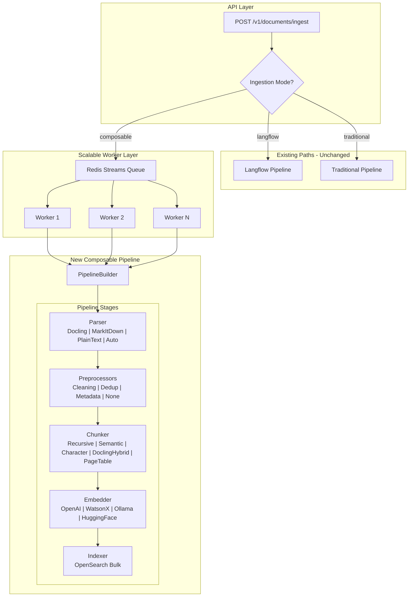
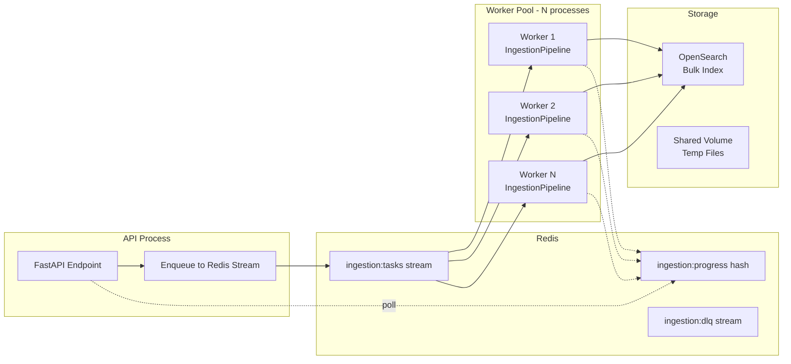

# Composable Ingestion Pipeline for OpenRAG

## Current State

OpenRAG has two ingestion paths controlled by `DISABLE_INGEST_WITH_LANGFLOW`:

- **Langflow path (default):** Upload -> Langflow ingest flow -> Docling -> CharacterTextSplitter -> Embedding -> OpenSearch
- **Traditional path:** Upload -> docling-serve / text processing -> page/table chunking -> batched embeddings -> per-chunk OpenSearch index

Both share limitations: in-process asyncio tasks with a semaphore (`MAX_WORKERS`), in-memory task state (lost on restart), per-chunk OpenSearch indexing (no bulk), and no durable queue.

Key files:

- [src/models/processors.py](../src/models/processors.py) - `TaskProcessor.process_document_standard` (traditional pipeline)
- [src/services/task_service.py](../src/services/task_service.py) - asyncio background tasks + semaphore
- [src/utils/document_processing.py](../src/utils/document_processing.py) - `extract_relevant`, `process_text_file`
- [src/config/config_manager.py](../src/config/config_manager.py) - `KnowledgeConfig` dataclass
- [src/dependencies.py](../src/dependencies.py) - FastAPI DI

## Architecture Overview



## Design: Protocol-Based Stages

Each stage is a Python `Protocol` with a single async method. Implementations are registered in a component registry and selected by name from config.

```python
class DocumentParser(Protocol):
    async def parse(self, file_path: str, metadata: FileMetadata) -> ParsedDocument: ...

class Preprocessor(Protocol):
    async def process(self, doc: ParsedDocument) -> ParsedDocument: ...

class Chunker(Protocol):
    async def chunk(self, doc: ParsedDocument) -> list[Chunk]: ...

class Embedder(Protocol):
    async def embed(self, chunks: list[Chunk]) -> list[EmbeddedChunk]: ...

class Indexer(Protocol):
    async def index(self, chunks: list[EmbeddedChunk], metadata: FileMetadata) -> IndexResult: ...
```

The `IngestionPipeline` composes them:

```python
class IngestionPipeline:
    def __init__(self, parser, preprocessors, chunker, embedder, indexer): ...
    
    async def run(self, file_path: str, metadata: FileMetadata) -> PipelineResult:
        doc = await self.parser.parse(file_path, metadata)
        for pp in self.preprocessors:
            doc = await pp.process(doc)
        chunks = await self.chunker.chunk(doc)
        embedded = await self.embedder.embed(chunks)
        result = await self.indexer.index(embedded, metadata)
        return result
```

## File Structure

All new code goes in `src/pipeline/`:

```
src/pipeline/
    __init__.py
    types.py            # Shared data models (ParsedDocument, Chunk, EmbeddedChunk, etc.)
    registry.py         # Component registry (discover + register by name)
    pipeline.py         # IngestionPipeline orchestrator + PipelineBuilder
    config.py           # PipelineConfig pydantic model

    parsers/
        __init__.py     # Re-exports + auto-register
        base.py         # DocumentParser protocol
        docling.py      # Wraps existing docling_client.convert_file
        markitdown.py   # MarkItDown integration
        text.py         # Wraps existing process_text_file logic
        auto.py         # Auto-detect parser by file extension

    preprocessors/
        __init__.py
        base.py         # Preprocessor protocol
        cleaning.py     # Strip control chars, normalize whitespace
        dedup.py        # Content-hash dedup check against OpenSearch
        metadata.py     # Extract/enrich metadata (language, dates, etc.)

    chunkers/
        __init__.py
        base.py         # Chunker protocol
        recursive.py    # LangChain RecursiveCharacterTextSplitter
        character.py    # CharacterTextSplitter (matches Langflow flow)
        semantic.py     # Semantic chunking (embedding similarity-based splits)
        page_table.py   # Current extract_relevant logic (page + table chunks)
        docling_hybrid.py # Docling structure-aware + recursive fallback

    embedders/
        __init__.py
        base.py         # Embedder protocol
        openai_embedder.py
        watsonx_embedder.py
        ollama_embedder.py
        huggingface_embedder.py  # sentence-transformers local or API

    indexers/
        __init__.py
        base.py         # Indexer protocol
        opensearch_bulk.py  # Bulk indexing with batched _bulk API

    workers/
        __init__.py
        queue.py        # Redis Streams producer/consumer abstraction
        worker.py       # Standalone worker process entry point
        progress.py     # Redis-backed progress tracking
```

## Configuration Model

Extend `KnowledgeConfig` in [src/config/config_manager.py](../src/config/config_manager.py) with:

```python
@dataclass
class PipelineConfig:
    parser: str = "auto"                   # auto | docling | markitdown | text
    preprocessors: list[str] = field(default_factory=list)  # cleaning, dedup, metadata
    chunker: str = "recursive"             # recursive | character | semantic | page_table | docling_hybrid
    chunk_size: int = 1000
    chunk_overlap: int = 200
    embedder: str = ""                     # auto-resolved from embedding_provider
    indexer: str = "opensearch_bulk"
    batch_size: int = 100                  # docs per bulk index call
    worker_concurrency: int = 4            # parallel files per worker
```

Add `ingestion_mode` to `KnowledgeConfig`:

```python
ingestion_mode: str = "langflow"  # langflow | traditional | composable
pipeline: PipelineConfig = field(default_factory=PipelineConfig)
```

## Scalable Worker Architecture (for 1M documents)



Key design for 1M scale:

- **Redis Streams** as durable task queue (survives restarts, supports consumer groups for exactly-once delivery)
- **Worker processes** run independently (can be docker-compose services or k8s pods), each pulling from the stream
- **Bulk OpenSearch indexing** -- batch 100-500 chunks per `_bulk` call instead of per-chunk `index()`
- **Progress tracking** in Redis hashes -- API polls Redis instead of in-memory dict
- **Dead letter queue** for failed documents (retry or manual inspection)
- **Shared volume** for temp files between API and workers (already exists: `uploaded-documents` volume)
- **Backpressure** via Redis stream max length and consumer group lag monitoring

## Integration Points

### Router Change in [src/api/router.py](../src/api/router.py)

Currently switches on `DISABLE_INGEST_WITH_LANGFLOW`. Add a third branch:

```python
if ingestion_mode == "composable":
    # Enqueue to Redis, return task_id immediately
    task_id = await pipeline_service.enqueue(files, user, config)
    return {"task_id": task_id}
elif ingestion_mode == "langflow":
    # Existing Langflow path
elif ingestion_mode == "traditional":
    # Existing traditional path
```

### New Service: `PipelineService`

Registered in [src/main.py](../src/main.py) `initialize_services()` and exposed via [src/dependencies.py](../src/dependencies.py):

```python
def get_pipeline_service(services: dict = Depends(get_services)):
    return services.get("pipeline_service")
```

Responsible for: building pipelines from config, enqueuing to Redis, and providing progress/status.

### Settings API in [src/api/settings.py](../src/api/settings.py)

Add pipeline configuration fields to the knowledge settings endpoint so the UI can configure: parser, chunker, preprocessors, embedder, and worker concurrency.

### Docker Compose

Add `redis` service and `openrag-worker` service:

```yaml
redis:
  image: redis:7-alpine
  ports: ["6379:6379"]

openrag-worker:
  build: .
  command: python -m pipeline.workers.worker
  environment:
    REDIS_URL: redis://redis:6379
    # Same env as backend for OpenSearch, embedding providers, etc.
  volumes:
    - uploaded-documents:/app/uploaded-documents
  deploy:
    replicas: 4  # Scale workers independently
```

## What Stays the Same

- All existing Langflow ingestion code is untouched
- All existing traditional ingestion code is untouched
- `DISABLE_INGEST_WITH_LANGFLOW` continues to work as before
- Default `ingestion_mode` remains `"langflow"` -- zero breaking changes
- Existing `KnowledgeConfig` fields (`embedding_model`, `embedding_provider`, `chunk_size`, `chunk_overlap`) are reused by composable pipeline defaults

## Implementation Order

Build bottom-up: types -> protocols -> implementations -> pipeline -> workers -> API integration.

1. **Types and Protocols** -- `ParsedDocument`, `Chunk`, `EmbeddedChunk`, `FileMetadata`, `PipelineResult` data models; `DocumentParser`, `Preprocessor`, `Chunker`, `Embedder`, `Indexer` protocols
2. **Component Registry** -- register/get by name, auto-discovery of implementations
3. **Parsers** -- DoclingParser (wraps existing `docling_client`), MarkItDownParser (new), PlainTextParser (wraps existing `process_text_file`), AutoParser (extension-based dispatch)
4. **Preprocessors** -- CleaningPreprocessor, DedupPreprocessor (OpenSearch hash check), MetadataPreprocessor
5. **Chunkers** -- RecursiveChunker, CharacterChunker, SemanticChunker, PageTableChunker (wraps `extract_relevant`), DoclingHybridChunker
6. **Embedders** -- OpenAIEmbedder, WatsonXEmbedder, OllamaEmbedder, HuggingFaceEmbedder (all with batching and token-limit awareness)
7. **Bulk Indexer** -- OpenSearchBulkIndexer using `_bulk` API with configurable batch size, retry logic, and ACL support
8. **Pipeline Orchestrator** -- `IngestionPipeline` + `PipelineBuilder` that assembles stages from `PipelineConfig` via the registry
9. **Configuration** -- `PipelineConfig` dataclass, `ingestion_mode` in `KnowledgeConfig`, settings API support
10. **Redis Workers** -- Redis Streams queue (producer/consumer), standalone worker process, progress tracking
11. **API Integration** -- composable branch in `router.py`, `PipelineService`, registration in `main.py`/`dependencies.py`
12. **Docker Infrastructure** -- Redis and `openrag-worker` services in `docker-compose.yml`
