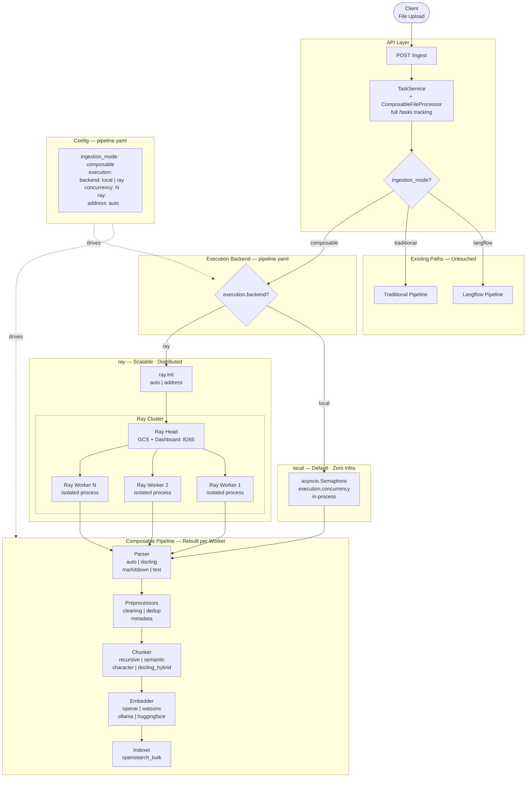
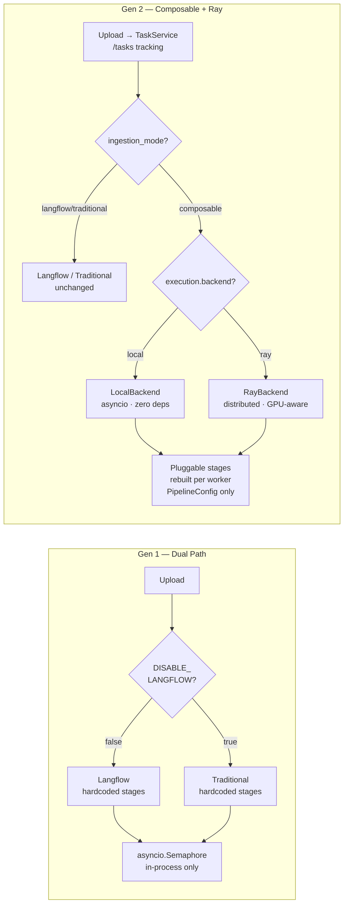
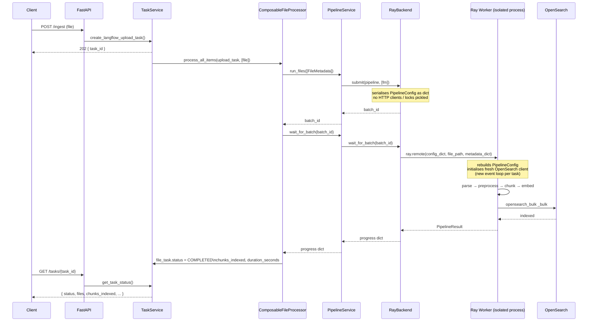

# OpenRAG Ingestion Architecture — Evolution Diagram

Compares two generations of the ingestion architecture: the original dual-path system and the composable pipeline with Ray.

---

## 1. Generation 1 — Original Dual-Path Architecture

The baseline before the composable pipeline. Two hardcoded paths, no pluggable stages, all in-process.

**Limitations:**
- Hardcoded stages — no way to swap parser, chunker, or embedder without code changes
- In-process `asyncio.Semaphore` — tasks lost on restart, no visibility
- Per-chunk OpenSearch writes — no bulk API, high latency at scale
- Two parallel codepaths to maintain

---

## 2. Generation 2 — Composable Pipeline with Ray

Protocol-based pluggable pipeline. Execution is an abstraction with two implementations: local asyncio and Ray.

---

## 3. Side-by-Side Comparison

---

## 4. Key Differences — Gen 1 vs Gen 2

| Concern | Gen 1 (Dual Path) | Gen 2 (Composable + Ray) |
|---|---|---|
| Stages | Hardcoded per path | Pluggable via `pipeline.yaml` |
| Parsers | Docling only | auto, docling, markitdown, text |
| Chunkers | Hardcoded (char / page-table) | recursive, semantic, character, docling_hybrid |
| Embedders | Hardcoded provider | openai, watsonx, ollama, huggingface |
| Indexing | Per-chunk writes | Bulk `_bulk` API |
| Concurrency | `asyncio.Semaphore` (fixed) | `execution.concurrency` or Ray scheduler |
| Scale | Single process | Local → Docker → IKS → Code Engine |
| GPU scheduling | None | Native via Ray |
| Fault tolerance | None | Built-in Ray retries + lineage |
| Monitoring | None | Ray Dashboard (:8265) |
| Task tracking | TaskService | TaskService (same + richer result) |
| Infra (local) | None | None (`local` backend needs zero extras) |
| Infra (scale) | N/A | Ray cluster (Docker / KubeRay) |

---

## 5. Deployment Topology — Ray Backend

```mermaid
flowchart TB
    subgraph local_dev [Local Dev · ray.init auto]
        DevApp["openrag-backend\n+ Ray head\n(same process)"]
    end

    subgraph docker [Docker Compose · --profile ray]
        DocApp["openrag-backend"]
        DocHead["ray-head :6379 :8265"]
        DocWorkers["ray-worker × N\n(langflowai/openrag-backend image)"]
        DocApp -->|"ray://ray-head:10001"| DocHead
        DocHead --> DocWorkers
    end

    subgraph iks [IBM Cloud IKS · KubeRay]
        IKSApp["openrag-backend pod"]
        IKSHead["RayCluster head"]
        IKSCPU["cpu-workers\nautoscale 1–20"]
        IKSGPU["gpu-workers\nIKS GPU pool"]
        IKSApp -->|"ray://head-svc:10001"| IKSHead
        IKSHead --> IKSCPU & IKSGPU
    end

    subgraph ce [IBM Code Engine · Serverless]
        CEApp["openrag-backend app"]
        CEHead["ray-head app\n(fixed scale 1)"]
        CEWorkers["ray-workers job\n(scale 0 → N)"]
        CEApp -->|"private endpoint"| CEHead
        CEHead --> CEWorkers
    end
```

---

## 6. Data Flow — Single File Through Ray Backend

