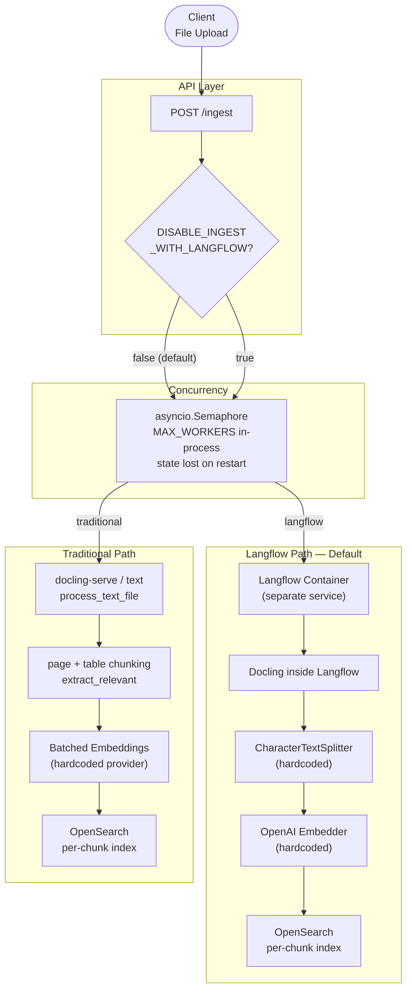
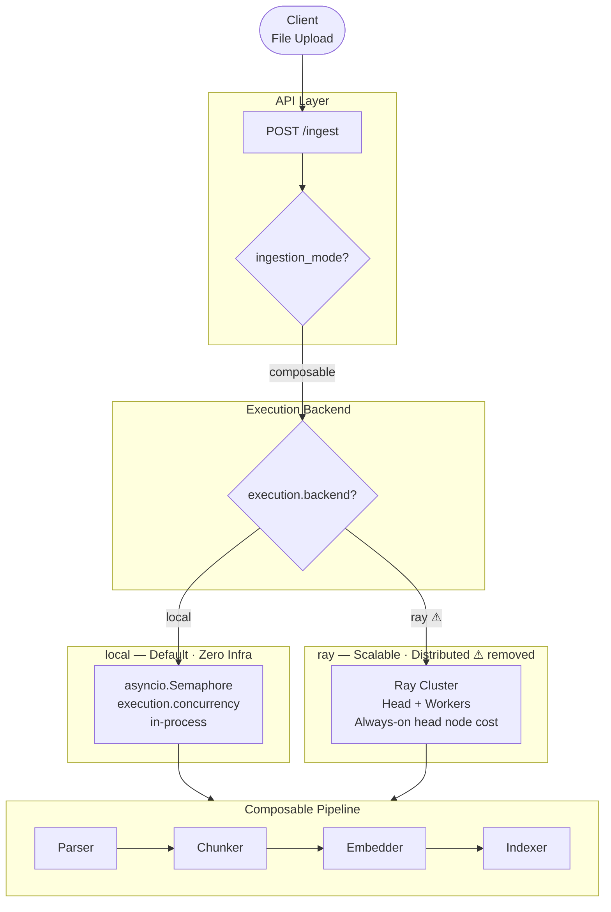
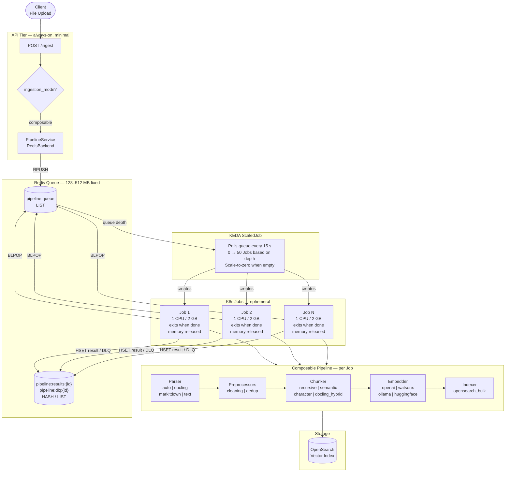
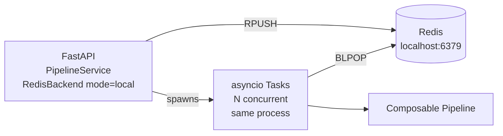
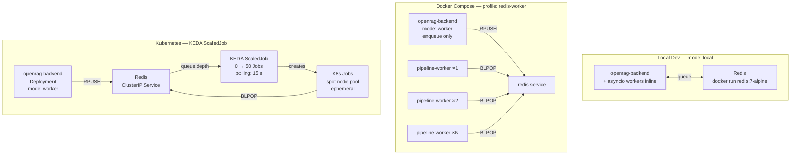
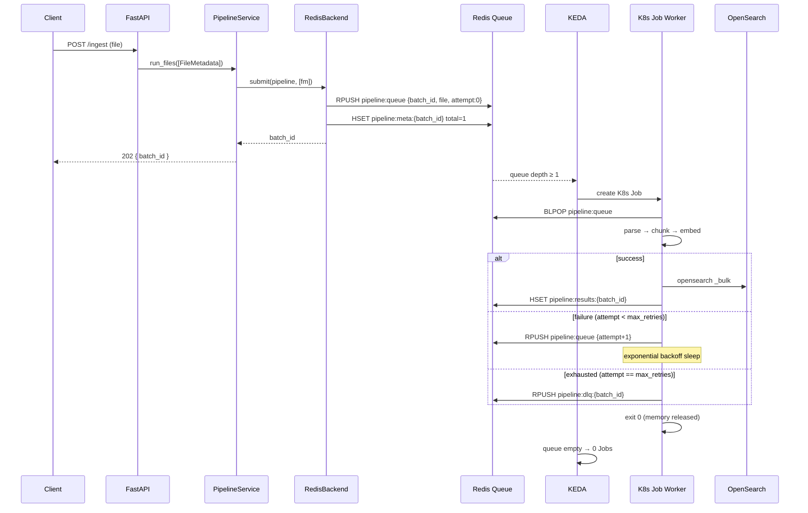

# OpenRAG Ingestion Architecture — Evolution Diagram

Three generations of the ingestion architecture, from the original dual-path
system through the composable Ray-based pipeline, to the current
Redis/KEDA queue-driven design.

---

## 1. Generation 1 — Original Dual-Path Architecture

The baseline before the composable pipeline. Two hardcoded paths, no pluggable
stages, all in-process.

**Limitations:**
- Hardcoded stages — no way to swap parser, chunker, or embedder without code changes
- In-process `asyncio.Semaphore` — tasks lost on restart, no visibility
- Per-chunk OpenSearch writes — no bulk API, high latency at scale
- Two parallel codepaths to maintain

---

## 2. Generation 2 — Composable Pipeline with Ray *(superseded)*

Protocol-based pluggable pipeline with two execution backends: local asyncio and
Ray for distributed processing.

> **Note:** Ray has been removed in Generation 3. This section documents the
> intermediate state for historical reference. See `Arch/why-not-ray.md` for
> the full reasoning.

**Why Gen 2 was improved:**
- Ray head node always running — fixed monthly cost even at zero load
- Memory not released between tasks in long-lived Ray workers
- KubeRay cluster adds operational complexity (head CRD, worker auto-scaler)
- Ray dependency (~300 MB) bloats the container image

---

## 3. Generation 3 — Redis Queue + KEDA *(current)*

Stateless, ephemeral workers triggered by queue depth. True scale-to-zero.
Same pipeline code; new execution layer below it.

**Also supported — local mode (no K8s needed):**

---

## 4. Comparison — All Three Generations

| Concern | Gen 1 | Gen 2 (Ray) | Gen 3 (Redis/KEDA) |
|---|---|---|---|
| Stages | Hardcoded | Pluggable YAML | Pluggable YAML |
| Idle cost | ~$0 | $$$ (Ray head always on) | $ (Redis only) |
| Scale to zero | N/A | No | Yes |
| Memory release | On restart | Partial (long-lived workers) | Yes (Job exits) |
| Fault tolerance | None | Ray retries | App retries + DLQ |
| Batch state | In-memory | In-memory | Redis (survives restart) |
| Local dev infra | None | None (`local` backend) | Redis Docker only |
| Cloud infra | N/A | KubeRay cluster | KEDA + Redis |
| Dependency size | N/A | +300 MB (Ray) | +2 MB (`redis`) |
| Horizontal API scale | No | No (shared Ray refs) | Yes (shared Redis queue) |
| GPU scheduling | No | Yes (Ray native) | Via node selectors |

---

## 5. Deployment Topology — Gen 3

---

## 6. Data Flow — Single File Through Redis Backend (worker mode)

