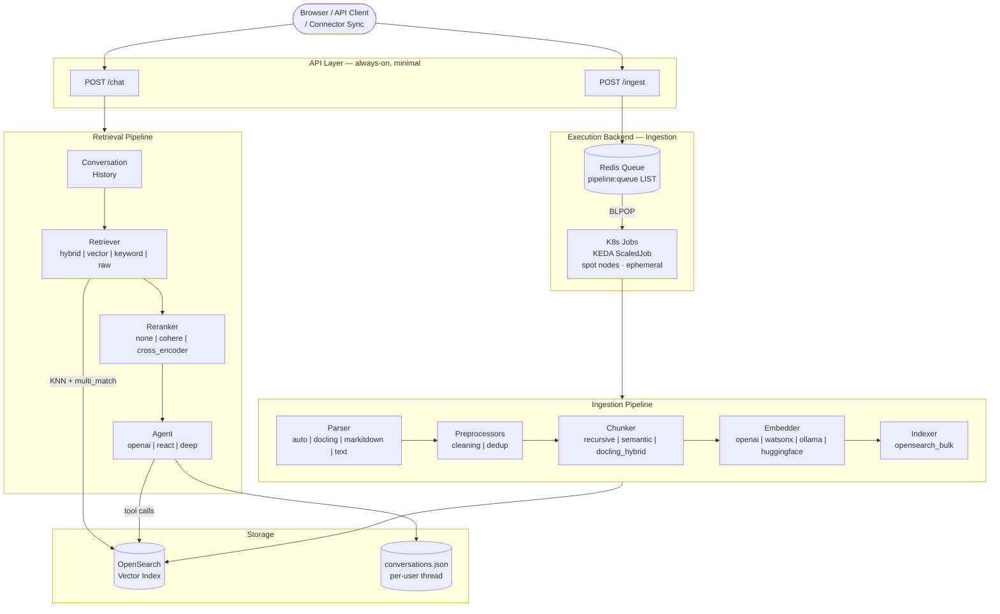
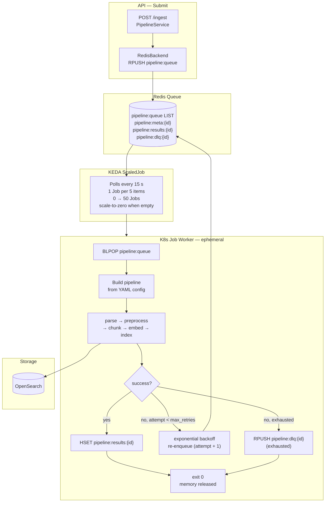
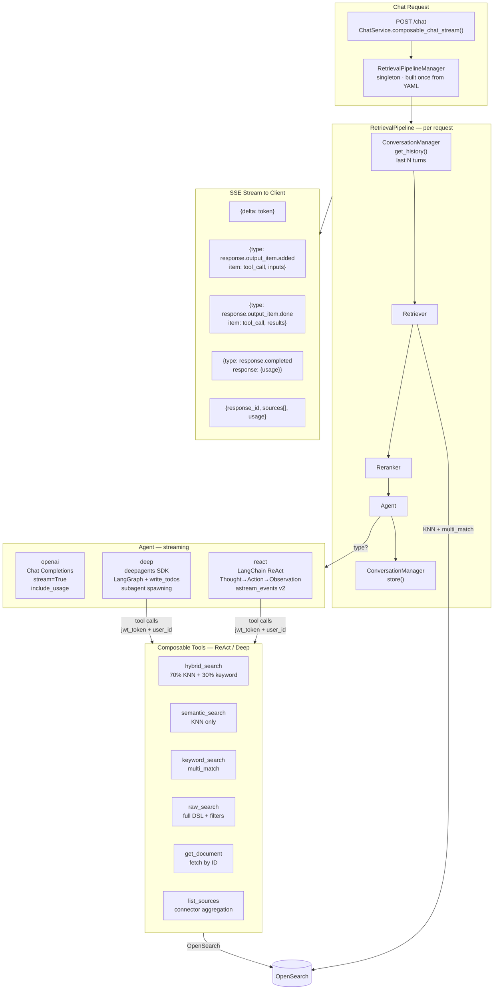
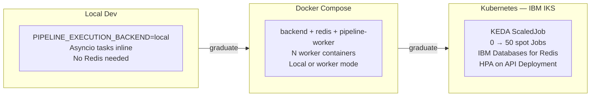

# OpenRAG — Composable Architecture Proposal

---

## The Problem with Version 1

Version 1 was built on Langflow as the orchestration backbone. Every
capability — document ingestion, chat, nudges, search — was wired to a
Langflow flow JSON. This created a hard ceiling on what the system could do.

### Core demerits

| Pain point | Impact |
|---|---|
| **Langflow as a hard dependency** | Any feature addition required editing a flow JSON inside Langflow's UI. No code review, no version control, no testability. |
| **Hardcoded stages** | Parser, chunker, embedder, and retrieval strategy were all fixed. Swapping `docling` for `markitdown` or switching from OpenAI to Watsonx meant modifying source code, not config. |
| **In-process concurrency** | Document ingestion ran inside the API process behind an `asyncio.Semaphore`. A pod restart dropped all in-flight work with no recovery. |
| **No visibility** | No batch status API, no retry tracking, no dead-letter queue. A failed document was silently lost. |
| **Dual retrieval codepaths** | When `DISABLE_LANGFLOW=false` the system called Langflow for chat and nudges. When `true` it fell back to a bare OpenAI call with no search, no reranking, no conversation history. |
| **No scaling surface** | Ingestion was bounded by the API pod's CPU. No horizontal scale, no worker tier, no queue. |
| **Langflow container overhead** | Every deployment carried the Langflow service even when only a fraction of its features were used. ~500 MB image, separate process, separate failure domain. |

---

## What the Composable Architecture Changes

Both ingestion and retrieval are now **protocol-based pipelines** configured
entirely via YAML presets and env-var overrides. Langflow is removed from the
critical path. Every stage is a registered, swappable component.

---

## Overall Architecture



---

## Ingestion Pipeline

### Design

Every ingestion job is a self-contained unit: one file → parse → preprocess →
chunk → embed → index. No shared state between files. The pipeline is rebuilt
fresh for each worker from a YAML config, so a config change takes effect on
the next job without a redeploy.



### Retry mechanism

```
attempt 0  →  pipeline.run()  →  failed  →  re-enqueue, sleep 1 s
attempt 1  →  pipeline.run()  →  failed  →  re-enqueue, sleep 2 s
attempt 2  →  pipeline.run()  →  failed  →  re-enqueue, sleep 4 s
attempt 3  →  exhausted  →  RPUSH pipeline:dlq:{batch_id}
```

Exponential backoff: `base_delay * 2^attempt`. DLQ items are surfaced via
`GET /ingest/status/{batch_id}` as `status: "failed"`.

Spot node eviction: a BLPOP-popped item is gone from the queue. For
production deployments use `BRPOPLPUSH` or Redis Streams with consumer group
ACK to survive pod preemption.

### Preset — `pipeline.yaml`

```yaml
version: "1"
ingestion_mode: composable

parser:
  type: auto           # routes .txt/.md → text, .pdf/.docx → docling, fallback → markitdown
  docling:
    ocr: false
    table_structure: false

preprocessors:
  - type: cleaning

chunker:
  type: docling_hybrid
  max_tokens: 512      # HybridChunker via docling-serve
  chunk_size: 1000     # fallback when docling-serve is unreachable
  chunk_overlap: 200

embedder:
  provider: openai
  model: text-embedding-3-small

indexer:
  type: opensearch_bulk
  bulk_batch_size: 500

execution:
  backend: redis
  concurrency: 4
```

### Env-var overrides

| Var | Controls |
|---|---|
| `PIPELINE_CONFIG_FILE` | Which preset to load |
| `PIPELINE_EXECUTION_BACKEND` | `local` or `redis` |
| `REDIS_WORKER_MODE` | `local` (inline workers) or `worker` (K8s Jobs) |
| `PIPELINE_CONCURRENCY` | Parallel files per worker |
| `PARSER_TYPE` | Override parser without changing YAML |

---

## Retrieval Pipeline

### Design

Every chat request runs: load conversation history → retrieve relevant
documents from OpenSearch → optionally rerank → run agent (which may call
tools for multi-hop search) → stream response → store turn in conversation.
Each stage is pluggable. The agent type drives the reasoning capability.



### Multi-hop reasoning (ReAct example)

```
Turn 1: hybrid_search("Q3 roadmap overview")       → retrieves broad results
Turn 2: keyword_search("committed delivery date")   → finds exact terms
Turn 3: raw_search({filters: {owner: "team-x"}})   → scopes to a team
Turn 4: get_document(doc_id)                        → fetches full text
Turn 5: synthesise across all retrieved context
```

Each tool call is streamed to the client as it happens, so the user sees
which searches were run and what came back before the final answer arrives.

### Preset — `retrieval.yaml` (default, fast)

```yaml
version: "1"

retriever:
  type: hybrid          # dis-max: 70% KNN + 30% multi_match
  semantic_weight: 0.7
  keyword_weight: 0.3
  limit: 10
  score_threshold: 0.0

reranker:
  type: "none"
  top_k: 10

agent:
  type: openai          # direct chat completion, no tool loop
  model: gpt-4o
  temperature: 0.7
  max_tokens: 2048
  tools:
    - semantic_search
    - keyword_search
    - hybrid_search
    - raw_search
    - get_document
    - list_sources
    - calculator

nudges:
  enabled: true
  type: langchain
  model: gpt-4o-mini
  max_suggestions: 5

conversation:
  rolling_window: 20
```

### Preset — `retrieval-react.yaml` (multi-hop tool use)

```yaml
version: "1"

retriever:
  type: hybrid
  semantic_weight: 0.7
  keyword_weight: 0.3
  limit: 10

reranker:
  type: "none"
  top_k: 10

agent:
  type: react           # LangChain ReAct: Thought → Action → Observation loop
  model: gpt-4o
  temperature: 0.7
  max_tokens: 2048
  max_iterations: 10
  tools:
    - semantic_search
    - keyword_search
    - hybrid_search
    - raw_search
    - get_document
    - list_sources
    - calculator

nudges:
  enabled: true
  type: langchain
  model: gpt-4o-mini
  max_suggestions: 5

conversation:
  rolling_window: 20
```

### Preset — `retrieval-deep.yaml` (research + planning)

```yaml
version: "1"

retriever:
  type: hybrid
  semantic_weight: 0.7
  keyword_weight: 0.3
  limit: 20             # broader initial retrieval for the planner

reranker:
  type: "none"
  top_k: 10

agent:
  type: deep            # deepagents SDK: LangGraph + write_todos + subagent spawning
  model: openai:gpt-4o
  temperature: 0.5
  max_tokens: 4096
  tools:
    - semantic_search
    - keyword_search
    - hybrid_search
    - raw_search
    - get_document
    - list_sources
    - calculator

nudges:
  enabled: true
  type: langchain
  model: gpt-4o-mini
  max_suggestions: 5

conversation:
  rolling_window: 20
```

### Env-var overrides

| Var | Controls |
|---|---|
| `RETRIEVAL_CONFIG_FILE` | Which preset to load |
| `RETRIEVAL_AGENT_TYPE` | `openai` / `react` / `deep` |
| `RETRIEVAL_AGENT_MODEL` | LLM model name |
| `RETRIEVAL_RETRIEVER_TYPE` | `hybrid` / `vector` / `keyword` / `raw` |
| `RETRIEVAL_RERANKER_TYPE` | `none` / `cohere` / `cross_encoder` |
| `RETRIEVAL_ROLLING_WINDOW` | Conversation history depth |

---

## Scalability

### Ingestion

| Concern | Mechanism |
|---|---|
| Scale to zero | KEDA creates 0 Jobs when queue is empty. Only Redis costs money at idle. |
| Horizontal scale | API replicas share one Redis queue — submit via any pod, drain via any worker. |
| Memory isolation | Each K8s Job processes one batch slice and exits. OS reclaims heap, ML weights, client pools. No memory leak path. |
| Spot node cost | ~$0.00004–0.0001 per document on spot nodes. Embedding API cost is typically 10× the compute cost. |
| Fault tolerance | Per-item retry with exponential backoff + dead-letter queue. Batch state survives pod restarts (Redis). |
| Config hot-swap | Change YAML preset → next Job picks it up. No redeploy needed. |

### Retrieval

| Concern | Mechanism |
|---|---|
| Stateless API | No session state in the API process. Any replica handles any request. |
| Streaming | NDJSON streaming via SSE. First token reaches the client before retrieval metadata is assembled. |
| Conversation isolation | Per-user rolling window stored in `conversations.json`. No cross-user state. |
| Tool auth | `jwt_token` and `user_id` are threaded from the request down into every tool call. OpenSearch access is user-scoped. |
| Agent swap | Switch `RETRIEVAL_AGENT_TYPE` env var — no code change, no redeploy of the pipeline. |

---

## Deployment Tiers



| Tier | Workers | Idle cost | Config |
|---|---|---|---|
| Local (inline) | asyncio tasks in API process | None | `PIPELINE_EXECUTION_BACKEND=local` |
| Docker Compose | `pipeline-worker` containers | Redis image | `REDIS_WORKER_MODE=local` |
| Kubernetes | KEDA K8s Jobs on spot nodes | Redis ClusterIP + ~$5–15/mo managed Redis | `REDIS_WORKER_MODE=worker` |

---

## Before vs After

| Concern | Version 1 (Langflow) | Composable |
|---|---|---|
| Add a new parser | Edit Langflow flow JSON | Add a class, register in YAML |
| Switch embedder | Code change + redeploy | Change one line in YAML |
| Ingestion scale | Bounded by API pod CPU | 0 → 50 spot K8s Jobs via KEDA |
| Failed document | Silently lost | Retry + DLQ, surfaced in status API |
| Chat with no search | Bare OpenAI call | Retriever → reranker → agent |
| Multi-hop search | Not possible | ReAct / Deep agent with 7 composable tools |
| Conversation history | Langflow session state | Rolling window per-user, any API replica |
| Langflow dependency | Required | Removed entirely |
| Config surface | Langflow UI (no VCS) | YAML files + env vars (VCS, CI-friendly) |
