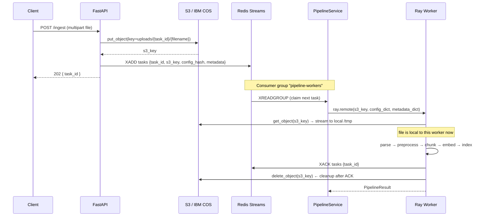
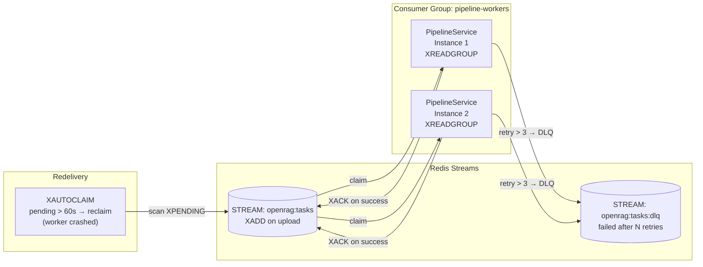
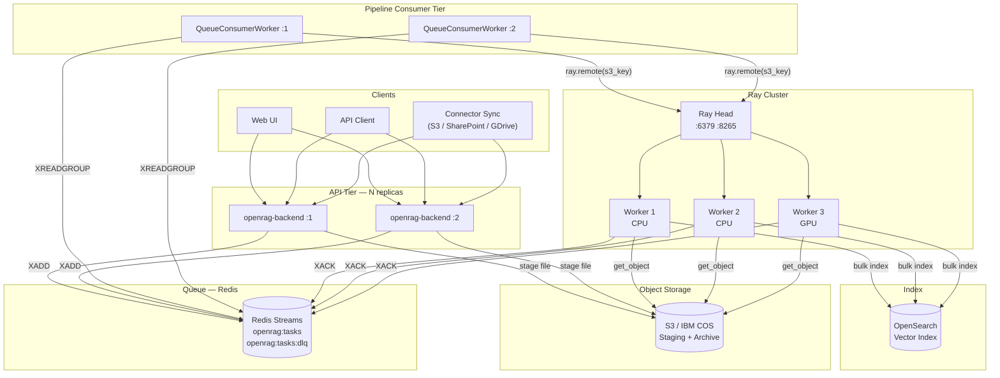
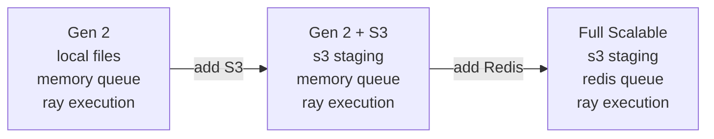

# OpenRAG — Scalable Composable Architecture (Proposed)

Proposed future enhancement to the Gen 2 composable pipeline for large-scale, crash-resilient document ingestion:

1. **S3-backed file staging** — uploaded files are written to object storage (S3 / IBM COS) before processing; Ray workers pull from S3 rather than accessing local temp files.
2. **Redis-persisted Ray task queue** — Ray task submissions are durable via a Redis Streams queue; unprocessed tasks survive Ray cluster restarts.

---

## 1. Motivation

| Limitation in Gen 2 | Impact | Proposed Fix |
|---|---|---|
| Files are temp files on the API host | Ray workers on other nodes can't access them; lost on restart | Stage files to S3 before submission |
| Ray task refs live only in `RayBackend._batches` (in-memory) | Tasks lost if the API process restarts | Persist task queue to Redis Streams |
| Worker pulls work via `ray.remote()` only | No replay, no dead-letter, no cross-restart durability | Redis consumer groups + ACK pattern |
| Single file upload temp path is node-local | Can't scale API tier horizontally without shared filesystem | S3 as shared staging layer |

---

## 2. High-Level Architecture

```mermaid
flowchart TB
    Client(["Client\nFile Upload"])

    subgraph api [API Tier — horizontally scalable]
        Upload["POST /ingest"]
        TaskSvc["TaskService\n+ ComposableFileProcessor"]
        S3Stage["S3 / IBM COS\nFile Staging Bucket"]
        RedisQ[("Redis Streams\nDurable Task Queue\nConsumer Groups")]
    end

    subgraph pipeline_svc [PipelineService]
        PS["PipelineService\nRayBackend"]
    end

    subgraph ray_cluster [Ray Cluster]
        RayHead["Ray Head\nGCS + Dashboard :8265"]
        subgraph workers [Ray Workers — isolated processes]
            RW1["Worker 1"]
            RW2["Worker 2"]
            RWN["Worker N"]
        end
        RayHead --> RW1 & RW2 & RWN
    end

    subgraph pipeline_stages [Composable Pipeline — per Worker]
        direction LR
        Parser["Parser\nauto | docling\nmarkitdown | text"]
        Pre["Preprocessors\ncleaning | dedup\nmetadata"]
        Chunker["Chunker\nrecursive | semantic\ndocling_hybrid"]
        Embedder["Embedder\nopenai | watsonx\nollama | huggingface"]
        Indexer["Indexer\nopensearch_bulk"]
        Parser --> Pre --> Chunker --> Embedder --> Indexer
    end

    subgraph storage [Storage Layer]
        OS[("OpenSearch\nVector Index")]
        S3Store[("S3 / IBM COS\nDocument Storage")]
    end

    Client -->|"multipart upload"| Upload
    Upload -->|"1 write file"| S3Stage
    Upload --> TaskSvc
    TaskSvc -->|"2 enqueue task\n{s3_key, metadata}"| RedisQ
    TaskSvc -->>|"202 { task_id }"| Client

    RedisQ -->|"3 claim task\nXREADGROUP"| PS
    PS -->|"4 ray.remote(s3_key, config)"| RayHead

    RW1 & RW2 & RWN -->|"5 download file\nfrom S3"| S3Store
    RW1 & RW2 & RWN --> Parser
    Indexer -->|"6 bulk index"| OS
    RW1 & RW2 & RWN -->|"7 XACK task"| RedisQ
    RW1 & RW2 & RWN -->|"8 delete staged file"| S3Stage
```

---

## 3. File Staging Flow — S3



---

## 4. Redis Streams Queue — Durable Task Persistence

### Why Redis Streams (not a plain Ray queue)

| Concern | Ray refs only (Gen 2) | Redis Streams (proposed) |
|---|---|---|
| Survives API restart | No — refs lost in memory | Yes — XREADGROUP re-delivers |
| Survives Ray cluster restart | No | Yes — unACKed tasks re-claimed |
| Dead-letter / failed tasks | No | Yes — XPENDING + DLQ stream |
| Horizontal API scaling | No — each instance has own refs | Yes — shared consumer group |
| Task replay | No | Yes — XRANGE from any ID |
| Visibility / monitoring | Ray Dashboard only | Redis CLI + any Redis UI |

### Consumer Group Pattern



### Message Schema

```json
{
  "task_id":    "uuid4",
  "s3_bucket":  "openrag-staging",
  "s3_key":     "uploads/2026/04/01/{task_id}/{filename}",
  "filename":   "IBM Cloud April 2026.pdf",
  "mimetype":   "application/pdf",
  "file_size":  2048576,
  "file_hash":  "sha256:abc123...",
  "owner_user_id": "user-xyz",
  "connector_type": "local",
  "config_hash": "sha256:pipeline-yaml-hash",
  "enqueued_at": "2026-04-01T10:00:00Z",
  "retry_count": 0
}
```

---

## 5. S3 Bucket Layout

```
openrag-staging/
└── uploads/
    └── {YYYY}/{MM}/{DD}/
        └── {task_id}/
            └── {original_filename}       ← deleted after successful XACK

openrag-archive/                          ← optional long-term storage
└── {connector_type}/
    └── {owner_user_id}/
        └── {document_id}/
            └── original/{filename}
            └── parsed/{filename}.json    ← ParsedDocument for re-indexing
```

---

## 6. Component Changes Required

### New Components

| Component | Where | Purpose |
|---|---|---|
| `S3StagingService` | `src/services/s3_staging_service.py` | Upload/download/delete from S3; wraps `boto3` / `ibm-cos-sdk` |
| `RedisPipelineQueue` | `src/pipeline/queue/redis_queue.py` | XADD, XREADGROUP, XACK, XAUTOCLAIM, DLQ routing |
| `QueueConsumerWorker` | `src/pipeline/queue/consumer.py` | Long-running asyncio loop; claims tasks, dispatches to RayBackend |
| `S3FileDownloader` | inside `ray_backend.py` worker fn | Downloads S3 file to worker-local `/tmp` before pipeline runs |

### Modified Components

| Component | Change |
|---|---|
| `ComposableFileProcessor.process_all_items` | Write to S3, enqueue to Redis instead of calling `run_files()` directly |
| `_execute_pipeline_file_on_worker` | Accept `s3_key` instead of `file_path`; download from S3 first |
| `RayBackend.submit` | Optionally accept pre-enqueued Redis message IDs |
| `docker-compose.yml` | Add `redis` service under `profiles: ["ray"]` |
| `pipeline.yaml` | Add `queue.backend: redis` + `staging.backend: s3` sections |

---

## 7. Updated `pipeline.yaml` Schema (Proposed)

```yaml
ingestion_mode: composable

staging:
  backend: s3               # local (Gen 2 default) | s3
  s3:
    bucket: openrag-staging
    prefix: uploads/
    region: us-south
    # credentials from env: AWS_ACCESS_KEY_ID / IBMCLOUD_COS_APIKEY

queue:
  backend: redis            # memory (Gen 2 default) | redis
  redis:
    url: redis://redis:6379
    stream: openrag:tasks
    consumer_group: pipeline-workers
    pending_timeout_seconds: 60   # reclaim after this long
    max_retries: 3
    dlq_stream: openrag:tasks:dlq

execution:
  backend: ray
  concurrency: 16
  ray:
    address: auto
    num_cpus_per_task: 1
    max_retries: 3
```

---

## 8. Full Scalable Deployment



---

## 9. Migration Path from Gen 2

No breaking changes — the new components are opt-in via `pipeline.yaml`:

```
Gen 2 (current)                    →   Scalable (proposed)
─────────────────────────────────────────────────────────────
staging.backend: local (default)   →   staging.backend: s3
queue.backend: memory (default)    →   queue.backend: redis
execution.backend: local | ray     →   execution.backend: ray (unchanged)
```

Existing deployments continue to work with `staging.backend: local` + `queue.backend: memory` (current Gen 2 behaviour). Opt into S3 staging and Redis queue independently.


