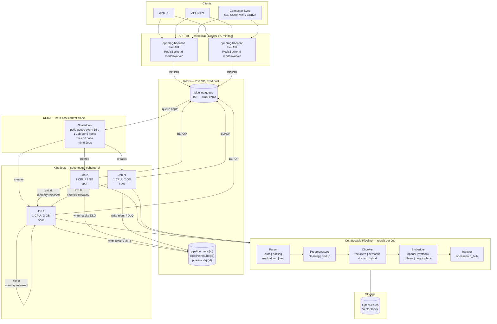

# OpenRAG — Scalable Composable Architecture

How the composable pipeline scales from a single laptop to a Kubernetes cluster
with zero idle cost, using Redis as the work queue and KEDA to drive ephemeral
K8s Job workers.

> **Previous version of this document** proposed S3 staging + Redis Streams on
> top of Ray. That design has been superseded: Ray has been removed entirely and
> replaced with a simpler Redis LIST queue + KEDA ScaledJob pattern.
> See `Arch/why-not-ray.md` for the reasoning.

---

## 1. Core Insight

The composable pipeline is already stateless — each file is a self-contained
unit processed by parse → chunk → embed → index with no shared state between
files. The only requirement for scaling is **how work is distributed** to
processing units, and **how those units are torn down when idle**.

The answer: a Redis LIST as the queue; KEDA ScaledJob to create ephemeral K8s
Jobs that drain the queue and exit.

---

## 2. Architecture



---

## 3. Why This Scales Well

### Scale to zero
When no files are queued, KEDA creates **zero Jobs**. The only always-on cost
is the API pod (0.1 CPU / 256 MB) and Redis (128–512 MB managed service,
~$5–15/mo). The processing tier costs nothing when idle.

### Memory always released
Each K8s Job processes one slice of the queue then **exits**. The OS reclaims
all memory (Python heaps, ML model weights if loaded, HTTP client pools).
There is no memory leak path. KEDA destroys the completed Job pod.
This is what makes node scale-down reliable: pods with fully-released memory
do not block the cluster autoscaler.

### Unit economics
| Resource | Rate | Per-document estimate |
|---|---|---|
| vCPU (spot) | ~$0.02–0.05 / vCPU-hr | ~2–5 CPU-sec/doc → **~$0.00004–0.0001** |
| Embedding API | OpenAI text-embedding-3-small | ~$0.00002 / 1k tokens |
| Redis | ~$10/mo fixed | Amortises over all docs |

### Horizontal API scaling
Because batch state lives in Redis (not in the API process's memory), multiple
API replicas can share the same queue. Submitting via API replica 1 and
polling progress via API replica 2 works correctly — both read from the same
Redis keys.

### Fault tolerance
```
File failure path
─────────────────
attempt 0 → pipeline.run() → status="failed"
  → retry after 1 s  (backoff: base * 2^0)
attempt 1 → pipeline.run() → status="failed"
  → retry after 2 s  (backoff: base * 2^1)
attempt 2 → pipeline.run() → status="failed"
  → retry after 4 s  (backoff: base * 2^2)
attempt 3 (= max_retries) → exhausted
  → RPUSH pipeline:dlq:{batch_id}
  → surfaced as status="failed" [DLQ] in get_progress()
```

If the Job pod itself is killed (OOM, preemption on spot node), the queue item
is **not ACKed** (BLPOP is atomic — the item was already popped). This means
a spot eviction loses the in-flight item. For production resilience, use
`BRPOPLPUSH` (pop and push to an in-flight list) or upgrade to Redis Streams
with consumer group ACK semantics. For most deployments, job-level K8s
`backoffLimit: 1` provides sufficient recovery.

---

## 4. Redis Key Schema

```
pipeline:queue                  LIST   Global work queue
                                       RPUSH by API, BLPOP by workers

pipeline:meta:{batch_id}        HASH   total, submitted_at
pipeline:inflight:{batch_id}    SET    Labels currently being processed
pipeline:results:{batch_id}     HASH   file_hash → PipelineResult JSON
pipeline:dlq:{batch_id}         LIST   Items that exhausted all retries
pipeline:cancelled:{batch_id}   STRING Set to "1" on cancel

All keys expire after result_ttl seconds (default 3600).
```

---

## 5. Queue Item Schema

```json
{
  "batch_id":    "uuid4",
  "file_hash":   "sha256:abc...",
  "metadata": {
    "file_path":     "/tmp/pipeline_xyz_report.pdf",
    "filename":      "report.pdf",
    "mimetype":      "application/pdf",
    "file_size":     204800,
    "owner_user_id": "user-xyz",
    "connector_type": "local"
  },
  "attempt":     0,
  "max_retries": 3
}
```

---

## 6. Deployment Tiers

| Tier | Command | Workers | Idle cost |
|---|---|---|---|
| Local dev (inline) | `PIPELINE_EXECUTION_BACKEND=redis uv run uvicorn ...` | asyncio tasks in API process | Redis Docker only |
| Local dev (separate) | `docker compose --profile redis-worker up` | `pipeline-worker` containers | Redis + worker images |
| Kubernetes | `kubectl apply -k kubernetes/redis/` | KEDA K8s Jobs on spot nodes | Redis ClusterIP only |
| Managed Redis | Replace `redis-deployment.yaml` with managed endpoint | Same | Lower ops overhead |

---

## 7. Scaling Parameters (KEDA ScaledJob)

Located in `kubernetes/redis/keda-scaledjob.yaml`:

```yaml
triggers:
  - type: redis
    metadata:
      listLength: "5"       # 1 Job per 5 queued items — tune per avg file size
pollingInterval: 15         # check queue every 15 s — lower = faster response
maxReplicaCount: 50         # ceiling — match your node pool capacity
```

Rule of thumb:
- Small files (< 1 MB): `listLength: 10`, `maxReplicaCount: 100`
- Large files (PDFs > 10 MB, Docling OCR): `listLength: 1`, `maxReplicaCount: 20`
- Mixed: `listLength: 5` (default)

---

## 8. Migration Path

No breaking changes. The Redis backend is a new opt-in execution backend:

```
Gen 2 (local asyncio)
  execution.backend: local
  No Redis needed

Gen 3 local mode (Redis + inline workers)
  execution.backend: redis
  execution.redis.mode: local
  Requires: Redis on localhost

Gen 3 worker mode (Redis + external K8s Jobs)
  execution.backend: redis
  execution.redis.mode: worker
  Requires: Redis + KEDA + pipeline-worker image
```

Switch between modes with a single env var:

```bash
# Local (no Redis)
PIPELINE_EXECUTION_BACKEND=local

# Redis local mode
PIPELINE_EXECUTION_BACKEND=redis REDIS_WORKER_MODE=local

# Redis worker mode (KEDA)
PIPELINE_EXECUTION_BACKEND=redis REDIS_WORKER_MODE=worker
```
